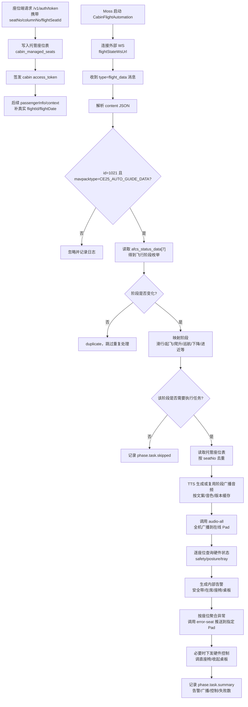

# 客舱飞行阶段自动化接口现状与缺口

更新时间：2026-07-07

本文用于记录 Moss 当前针对外部飞行状态、硬件状态查询、硬件控制、语音播报、告警与托管座位的实现现状，方便后续现场联调和与对方确认接口边界。

## 1. 当前已实现的主流程

当前 Moss 已经实现的闭环是：

```text
座位端获取 auth token
-> Moss 记录托管座位
-> Moss 订阅外部飞行状态 WS
-> 解析飞行阶段
-> TTS 生成或复用阶段广播音频
-> 调用对方全机广播接口推送播放
-> 读取托管座位
-> 查询 safety/posture/tray 硬件状态
-> 生成内部告警
-> 调用对方座位异常接口推送到指定 Pad
-> 必要时下发座椅调直、小桌板收起控制
-> 写入自动化日志，方便现场排查
```

流程图：



## 2. 已实现，部署时主要替换接口地址即可

| 能力 | 对方已知接口/消息 | Moss 当前实现 |
| --- | --- | --- |
| 飞行状态 WS 订阅 | `ws://.../infra/ws`，消息 `type=flight_data` | 已实现。配置 `cabin.flightStateWsUrl` 后自动连接；解析 `content` 字符串 JSON；校验 `id=1021`、`mavpacktype=CE25_AUTO_GUIDE_DATA`；读取 `afcs_status_data[7]` 作为阶段。 |
| 飞行阶段枚举映射 | `1-17` 阶段枚举 | 已实现。`1=taxi_in`、`16=taxiing`、`2=takeoff_prepare`、`3/4=takeoff`、`5/6=climb`、`7=cruise`、`8=descent`、`9-15=landing_approach`、`17=go_around`。 |
| 托管座位 | 座位端获取 auth token 时传入 `seatNo` | 已实现。`/v1/auth/token` 收到 `seatNo` 后立即写入 `cabin_managed_seats`，写入成功后才签发 token。若未带 `flightId/flightDate`，先用 `AUTO + 北京日期` 记录，后续 passengerInfo 再补真实航班。 |
| 硬件状态查询 | `GET /admin-api/tcp/hardware/status?target=&key=` | 已实现。按托管座位查询 `safety`、`posture`、`tray`。所有请求、响应、失败都会写自动化日志。 |
| 安全带/在席检查 | `key=safety` | 已实现。发现乘客未在席生成 `PASSENGER_NOT_PRESENT` 告警；发现安全带未扣生成 `SEATBELT_NOT_FASTENED` 告警。 |
| 座椅靠背/姿态检查 | `key=posture` | 已实现。发现座椅未归位生成 `SEAT_NOT_UPRIGHT` 告警，并下发调直座椅控制。 |
| 小桌板检查 | `key=tray` | 已实现。发现小桌板未收起生成 `TRAY_NOT_CLOSED` 告警，并下发收起小桌板控制。 |
| 座椅调直控制 | `POST /admin-api/tcp-client/cmd/seat/cushion?seatNo=&position=0` | 已实现。在滑行、起飞前准备、起飞、进近/降落等阶段，发现座椅未归位时下发。 |
| 小桌板收起控制 | `POST /admin-api/tcp-client/cmd/seat/tray/close?seatNo=` | 已实现。在滑行、起飞前准备、起飞、进近/降落等阶段，发现桌板未收起时下发。 |
| 自动化日志 | Moss 本地 JSONL | 已实现。默认写入 `<rootDir>/logs/cabin-automation.jsonl`，可通过 `cabin.automationLogFile` 配置。 |
| 告警记录 | Moss 内部表 `cabin_alerts` | 已实现。告警可通过 Moss admin API 查询。 |
| 全机阶段广播 | `POST /admin-api/cabin/broadcast/audio-all` | 已实现。阶段变化后按客户中英文文案生成 TTS 音频；相同文案、音色、模型、版本命中缓存直接复用；再以 multipart 上传到对方接口广播。 |
| 座位异常推送 | `POST /admin-api/cabin/broadcast/error-seat` | 已实现。内部告警仍逐条记录，对 Pad 推送按座位聚合为一条异常信息，减少重复弹窗。 |
| 托管座位查询 | Moss admin API | 已实现。可通过 `/api/v1/cabin/managed-seats` 查询。 |

部署时关键配置：

```json
{
  "cabin": {
    "enabled": true,
    "automationEnabled": true,
    "flightStateWsUrl": "ws://对方内网地址/infra/ws",
    "controlBaseUrl": "http://对方内网地址",
    "controlAuth": "test1",
    "aircraftNo": "B-WITHFLIGHT-01",
    "broadcastBaseUrl": "http://Moss可被对方访问的地址/v1/cabin/broadcasts",
    "broadcastApiBaseUrl": "http://对方内网地址",
    "broadcastApiKey": "对方 yudao.security.hardware-api-key",
    "broadcastAuth": "test1",
    "broadcastEnabled": true,
    "broadcastTtsVersion": "flight-phase-v1",
    "automationLogFile": "/var/log/moss/cabin-automation.jsonl"
  }
}
```

说明：

- `automationEnabled` 不是必填；不配置时默认开启。生产建议显式配置为 `true` 或 `false`。
- `automationLogFile` 不是必填；不配置时默认写到 `<rootDir>/logs/cabin-automation.jsonl`。生产建议配置到持久化日志目录。
- `aircraftNo` 用于配置托管座位没有携带飞机号时的默认飞机号；若座位上下文本身已有 `aircraftNo`，优先使用座位上下文。
- `broadcastApiBaseUrl` 不配置时会复用 `controlBaseUrl`。
- `broadcastApiKey` 会作为 `X-Hardware-Api-Key` 请求头发送，是对方广播接口要求的鉴权字段。
- `broadcastAuth` 是可选 `Authorization` 请求头；不配置时复用 `controlAuth`。
- `broadcastBaseUrl` 仍用于记录和调试本地生成的音频文件 URL；真实播放通过 `audio-all` 上传文件触发。
- `broadcastTtsVersion` 用于 TTS 缓存失效。客户文案或音色策略整体升级时，可以改版本强制重新生成。

## 3. 对方已有接口，但 Moss 当前还未纳入阶段自动化

| 能力 | 对方已知接口 | 当前状态 | 后续处理建议 |
| --- | --- | --- | --- |
| 小桌板展开 | `POST /admin-api/tcp-client/cmd/seat/tray/open?seatNo=` | 未接入自动化。当前阶段需求主要是收起桌板。 | 若巡航或服务场景需要自动展开，可新增阶段策略。 |
| 舷窗/玻璃调光 | 例如 `POST /admin-api/tcp-client/cmd/cabin/scene/clear?target=&gray=` | 未接入自动化。 | 需要先确认 `target` 与座位/区域的关系，以及 `gray=0` 是否代表全开。 |
| 顶灯/场景/阅读灯 | 对方已知控制接口 | 未接入自动化。 | 当前安全阶段需求暂不依赖。可后续用于巡航服务/客舱场景。 |
| 通风/加热/按摩/生理检测 | 对方已知座椅相关接口 | 未接入自动化。 | 当前滑行、起飞、下降、降落安全流程暂不需要。 |

这部分不是对方缺接口，而是 Moss 当前没有把它们写进飞行阶段策略。确认业务规则后可以继续扩展。

## 4. 仍缺失，需要对方提供或确认的接口

| 缺口 | 为什么需要 | 建议接口形态 |
| --- | --- | --- |
| 播放结果回调/状态查询 | 现场需要确认语音是否真正播放成功。 | 对方回调 Moss，或提供 `GET /broadcast/status?taskId=`。 |
| 座椅调整禁用/解除禁用 | 起飞阶段要求禁用座椅调整，目前只有调位置接口，没有 lock/unlock。 | `POST /cmd/seat/lock`、`POST /cmd/seat/unlock`。 |
| 小桌板调整禁用/解除禁用 | 起飞阶段要求禁用桌板调整，目前只有 open/close，没有禁止乘客操作的接口。 | `POST /cmd/tray/lock`、`POST /cmd/tray/unlock`。 |
| 卫生间占用查询 | 滑行、下降阶段要求检查卫生间占用。 | `GET /admin-api/tcp/hardware/status?target=lavatory&key=occupancy` 或同等接口。 |
| 卫生间限制/解除限制 | 下降阶段限制卫生间使用，巡航阶段解除限制。 | `POST /cmd/lavatory/lock`、`POST /cmd/lavatory/unlock`。 |
| 安全带信号/限制控制 | 巡航阶段要求解除安全带限制，下降阶段要求提示紧扣。如果需要控制安全带灯，需要接口。 | `POST /cmd/seatbelt-sign/on`、`POST /cmd/seatbelt-sign/off`。 |
| 控制命令异步状态查询 | 当前控制接口只能确认请求是否成功，无法确认硬件最终执行完成。 | 控制接口返回 `commandId`，再通过 `GET /cmd/status?commandId=` 查询。 |
| 乘客偏好接口 | 巡航阶段要求个性化匹配乘客偏好。 | 在 passengerInfo 中补偏好字段，或提供 `GET /passenger/preferences`。 |

说明：

- 全机语音播放通知已由 `audio-all` 补齐。
- 座位异常主动推送已由 `error-seat` 补齐。
- 如果需要确认 Pad 是否真正播放/展示成功，仍需要对方补播放状态回调或状态查询。

## 5. 阶段策略当前覆盖情况

| 飞行阶段 | 当前 Moss 动作 | 当前缺口 |
| --- | --- | --- |
| `1` 滑入 | 检查 `safety/posture/tray`；告警；必要时调直座椅、收桌板。 | 卫生间占用查询；卫生间限制；语音播放通知。 |
| `16` 滑行/划出 | TTS 生成/复用滑行中英文广播音频；调用 `audio-all` 全机广播；检查 `safety/posture/tray`；内部告警；调用 `error-seat` 推送座位异常；必要时调直座椅、收桌板。 | 卫生间占用查询；舷窗检查/控制。 |
| `2` 起飞前准备 | 检查 `safety/posture/tray`；告警；必要时调直座椅、收桌板。 | 座椅/桌板禁用接口；舷窗控制接口。 |
| `3/4` 起飞 | 检查 `safety/posture/tray`；告警；必要时调直座椅、收桌板。 | 座椅/桌板禁用接口；舷窗控制接口。 |
| `5/6` 爬升 | TTS 生成/复用爬升中英文广播音频；调用 `audio-all` 全机广播；检查 `safety`；内部告警；调用 `error-seat` 推送座位异常。 | 解除座椅/桌板限制接口。 |
| `7` 巡航 | 当前跳过自动化任务。 | 客舱服务策略；卫生间解除限制；安全带限制解除；乘客偏好。 |
| `8` 下降 | TTS 生成/复用下降中英文广播音频；调用 `audio-all` 全机广播；检查 `safety`；内部告警；调用 `error-seat` 推送座位异常。 | 卫生间限制接口；安全带信号/限制接口。 |
| `9-15` 进近/降落 | TTS 生成/复用降落进近中英文广播音频；调用 `audio-all` 全机广播；检查 `safety/posture/tray`；内部告警；调用 `error-seat` 推送座位异常；必要时调直座椅、收桌板。 | 舷窗检查/控制；座椅/桌板禁用接口。 |
| `17` 复飞 | 已映射阶段，但当前不执行任务。 | 复飞专用播报和安全策略待确认。 |

## 6. Moss 查询接口

这两个接口主要用于我们自己后台查询和现场排障，需要 Moss 管理端 token，不是 cabin 座位端 token。

### 查询托管座位

```bash
curl -sS "$MOSS/api/v1/cabin/managed-seats?active=true" \
  -H "Authorization: Bearer $TOKEN"
```

支持参数：

```text
aircraft_no
flight_id
flight_date
active=false
```

### 查询告警

```bash
curl -sS "$MOSS/api/v1/cabin/alerts?status=active&limit=50" \
  -H "Authorization: Bearer $TOKEN"
```

支持参数：

```text
flight_id
flight_date
seat_no
status=active|resolved
limit=50
offset=0
```

## 7. 联调排查建议

现场联调时建议按以下顺序排查：

1. 看 `/api/v1/cabin/managed-seats`，确认座位是否已经因为 `/v1/auth/token` 或配置被 Moss 纳管。
2. 看 `cabin-automation.jsonl`，确认 WS 是否连接、原始消息是否收到、`flight_data` 是否解析成功。
3. 看 `flight.phase.changed` 和 `phase.task.summary`，确认阶段变化是否触发任务。
4. 看 `hardware.status.request/response`，确认硬件状态接口地址、鉴权、返回结构是否符合预期。
5. 看 `/api/v1/cabin/alerts`，确认异常状态是否转成告警。
6. 看 `broadcast.tts.cache_hit`、`broadcast.tts.generated`，确认 TTS 是否命中缓存或生成成功。
7. 看 `broadcast.audio_all.request/success/failed`，确认全机广播是否调用成功，以及对方返回的 `requestId/matchedCount/sentCount`。
8. 看 `broadcast.error_seat.request/success/failed`，确认座位异常是否推送到对应 Pad。
9. 看 `hardware.control.request/response`，确认座椅调直、小桌板收起指令是否下发成功。

## 8. 当前结论

当前基于对方已知接口，Moss 已经可以先实现：

```text
飞行状态订阅
-> 阶段识别
-> 托管座位加载
-> TTS 阶段广播生成/复用
-> 对方全机广播接口播放
-> 安全带/在席/座椅/桌板状态检查
-> 内部告警
-> 对方指定座位异常推送
-> 座椅调直/小桌板收起
-> 完整日志排查
```

还不能完整闭环的部分是：

```text
座椅/桌板禁用与解除
卫生间占用与限制
舷窗阶段策略
Pad 播放/展示结果回调
硬件控制最终执行结果确认
```

这些需要对方继续提供接口，或明确采用 Moss admin API 轮询/人工查询作为临时方案。
