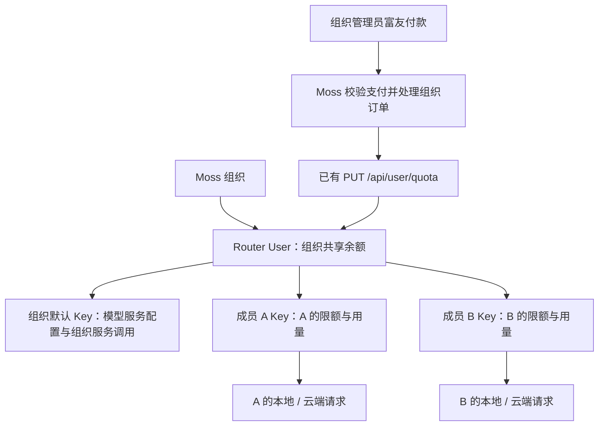

# Moss 组织 Router 共享账户与成员 Key 方案

初稿：2026-09-23。更新：2026-09-29。状态：设计方案，尚未实施业务改造。

本文已按最新确认的需求修订，替代初稿中的个人充值、资金预分配和充值双步骤设计。当前采用“组织共享资金 + 成员消费限额”，并按用户确认全面取消积分：组织模型余额、成员限额、费用和赠额统一按美元（USD）计价；富友仍收人民币（CNY），内部计量保留整数 quota。保留组织默认 Key 和组织管理员充值；开户、创建 Key、充值使用已有 Router 接口，仅新增 3 项成员 Key 管理能力。

配套文档：[现状核查与改造位置](/Users/yobach/VSCodeProject/moss/docs/plans/2026-09-29-organization-shared-router-account-review.md)、[接口清单与请求响应示例](/Users/yobach/VSCodeProject/moss/docs/plans/2026-09-29-sudorouter-integration-api-draft.md)。本文描述整体设计，接口路径及具体语义以接口文档为准；第 13 节保留此前核验记录，并区分源码事实与本期范围。本次只更新文档，未调用真实支付、开户或加额接口。

## 1. 目标与首版边界

一个 Moss 组织对应一个 Router User。组织默认 Key 与组织下每名成员的 Key 均属于该 User，共享账户余额。组织管理员自己的模型请求也使用其成员 Key。



首版一名成员一把有效消费 Key，同一成员多设备共用。创建时选择有限/不限额，有限额 Key 可追加或降低剩余限额；运行中切换限额模式、Key 轮换、周期预算、多 Key 和自动组织退款延后。

最新产品决策：创建组织时设置初始额度（USD）；后台创建成员可设置限额（USD）或选择不限额，邀请码注册继承组织默认设置。产品保留“限额”名称；充值、收费规则沿用既有设计。公司共享余额是明确的业务选择，额度耗尽只提示“额度不足”，不新增低余额预警或复杂引导。此前产品评审中未采纳的建议不作为首版要求，见[产品决策记录](/Users/yobach/VSCodeProject/moss/docs/plans/2026-09-29-organization-router-product-review.md)。

所有已有 Router 接口的路径、参数、响应、鉴权和行为保持不变。组织、成员、权限及业务绑定由 Moss 维护，不要求 Router 新建组织表或重新实现开户/充值。

## 2. 余额与限额：资金共享，不做成员资金预分配

| 数据 | 权威来源 | 含义 |
|---|---|---|
| 组织余额 | Router User.quota | 实际可消费的组织资金 |
| 成员剩余限额 | 有限额 Token.remain_quota | 允许该成员继续使用多少共享资金，不是独立钱包 |
| 成员消费 | Token 用量及按 Token ID 归属的消费记录 | 当前 Key 的 used_quota 不等于个人累计充值，也不涵盖历代 Key 的全部历史 |
| 充值订单 | Moss 组织订单和账本 | 付款人、组织收款账户、USD 购买/赠送额度、CNY 实付、quota、支付状态和入账状态 |
| 限额调整记录 | Moss 管理审计与 Router 成员额度命令 | 谁调整了多少使用权限，不是充值/转账 |

当前代码基准为 **1 USD 模型额度 = 500,000 Router quota**。新业务直接换算 USD 与 quota，不再经过积分；模型输入输出 Token 数保持原单位，不能当作费用。部署时核实并固化 quota_per_usd，不能把 Router 的显示币种或人民币汇率当作此换算系数。

| 操作 | 组织 User 余额 | 成员 Token 限额 |
|---|---|---|
| 组织管理员购买 X USD 模型额度 | 增加 X USD（赠送另记） | 所有成员保持不变 |
| 给 A 追加/降低 X USD 限额 | 不变 | 仅 A 增加/降低 X USD |
| A 消费 C USD | 减少 C USD | 有限额 A 减少 C USD，B 不变 |
| 停用 A | 不变 | 撤销消费入口；不转移或退款 |

例如组织有 $100.00，A/B 各有 $80.00 剩余限额；A 消费 $50.00 后，组织余额 $50.00，A 限额 $30.00，B 仍为 $80.00。成员实际消费还受当时组织余额、预扣和模型权限约束。限额之和可以大于组织余额，不能建立“组织余额 = 未分配余额 + 成员限额”的资金等式，也不增加“可分配资金”账本。

“不限额”仅取消成员自身上限，仍受组织资金约束。调限额不改变历史消费；组织充值不自动提高成员限额或恢复冻结状态。产品未确认的注册赠额或额外资金不能因新增成员而自动注入共享账户。

### 2.1 全面取消积分的范围

新业务不再有积分账户、积分余额、积分套餐、积分奖励、积分发放/审批或积分兑换系数。主页面、后台、API、导出、通知、套餐配置、限额模板、运行时余额判断和新账本统一改造；不能仅把 points 数值加上美元符号，也不能保留“USD → 积分 → quota”的计算链路。原积分申请/审批关闭，成员只管理 USD 消费限额。

历史记录和一次性迁移工具可保留原字段/原单位以便追溯；它们不参与新业务余额计算，不作为长期积分兼容层。全面取消积分不删除支付事实、历史资产或赠送权益。

### 2.2 三种单位与精度

| 用途 | 单位及存储 | 规则 |
|---|---|---|
| 模型余额、成员限额、模型费用 | UI/API 标注 USD；权威余额/变动为整数 quota | 当前 quota_per_usd=500000，1 quota=$0.000002；直接转换，不经积分 |
| 购买与赠送模型额度 | USD 定点微单位，1 USD=1,000,000 微单位 | 分别保存 purchase_usd_micros、bonus_usd_micros；两者合计确定本笔 credited_quota |
| 富友付款/退款 | CNY，整数人民币分 | amount_cny_fen 来自订单固化金额；回调按人民币分校验，不能拿 USD 金额核验 |
| 汇率 | 1 USD 对应多少 CNY 的定点十进制及规则版本 | 下单确定，订单保存快照；汇率改变不重估已入账模型余额、历史订单或成员限额 |

USD 模型额度表示可购买模型服务的计价额度；当前方案不接入美元支付通道。购买和人工限额输入首版采用两位小数的 USD 十进制字符串，服务端严格校验精度、正负方向和范围；实际消费/剩余余额保留 quota 精度。UI 概览通常显示两位，小额非零余额须显示更多位或小额提示，费用明细可显示六位；判断可用性、累计、扣费和对账始终使用原始整数，不能对每笔费用先保留两位再求和。API 的 USD 结果用明确币种的定点字符串，不能依赖浮点隐式运算。

当前换算下 purchase/bonus 微单位合计除以 2 即 quota；每 $0.01 对应 5000 quota。统一转换入口验证整数可表示性和安全范围，避免截断或隐式赠额。人民币应付按购买 USD 与订单汇率计算，在下单时按四舍五入确定到分并固化；回调不重新计算。若部署换算系数不同，应按实际系数及历史快照处理，不能直接套用本段数值或在迁移中改变定价。

### 2.3 充值与赠送示例

购买 $10.00 模型额度，按现有等值优惠赠送 $1.00；假设订单汇率为 7.30 CNY/USD，应付 ¥73.00，到账 $11.00，即 5,500,000 quota。富友校验金额为 7300 分；赠送不增加实付款，所有成员限额不变。汇率仅用于示例，不表示实时汇率或新的固定价格。

套餐取消 points/bonus_points 配置，改为 USD 购买金额和 USD 赠送额度；旧已生效优惠按等值迁移，取消积分不默认取消优惠或扩大赠额。购买、赠送、退款及其规则快照分开记录，模型余额不能当作可原额提现的美元现金余额；历史退款仍以原订单人民币实付、原赠送规则和已消费情况处理，不按最新汇率重算。

购买金额由管理员在允许范围内选择；赠送额度、人民币汇率及实付金额由 Moss 按有效套餐/配置计算并固化，客户端不能自行指定赠额或修改支付价格。

## 3. 数据关系和凭据

复用 billing_external_accounts 保存 ownerType=organization 的组织绑定，新增成员/组织服务 Token 绑定。现有 provider + external_account_id 唯一约束不能通过让所有个人绑定指向同一 Router User 来绕过。

| 记录 | 必要内容 |
|---|---|
| 组织 Router 绑定 | org_id、router_user_id、计费模式、开通状态；一个组织一个有效绑定 |
| Token 绑定 | org_id、user_id（组织服务可空）、purpose、router_user_id、router_token_id、秘密引用、状态及创建/停用时间 |
| 组织充值订单 | billing_scope、org_id、收款 Router 绑定及 user_id、付款管理员、USD 购买/赠送金额、CNY 实付分、quota、汇率/定价快照、支付/入账独立状态 |
| 开通和外部操作 | 本地稳定操作号、步骤、目标、请求/响应摘要、发送/成功/待核对状态；秘密不进日志 |
| 用量与审计 | 按 Router Token ID 映射当时成员；历史映射不删除；记录查询时间及同步状态 |

平台 Router 管理凭据只在 Moss 后端；组织默认 Key 存服务端，用于组织模型服务；成员 Key 仅供对应成员的受管理请求。凭据必须按 orgId + userId + providerId 解析，不以全局用户 ID 代替组织上下文。

### 3.1 新业务数据与 API 去积分

新模型账本/镜像余额的权威单位采用 quota；USD 为直接派生展示值，避免 quota 和 USD 两套余额各自更新。支付账本以 CNY 分记录收付款；订单的 USD 购买/赠送及 credited_quota 是不可变业务快照，不能用当前余额回推。

Moss 套餐/订单字段采用明确单位：purchase_usd_micros、bonus_usd_micros、credited_quota、amount_cny_fen、exchange_rate_micros、quota_per_usd、定价规则版本。可以复用现有 amount_usd_micros、amount_cents、quota_units 等等价字段，但须固定其语义；原 points_units、bonus_units、creditPool、个人 balance 等积分字段不继续生成、双写或成为新业务必填列。

Moss/Sudowork 新接口使用 model_balance_usd、remaining_limit_usd、used_amount_usd、purchase_amount_usd、bonus_amount_usd 等带单位字段；消除原 points、total/remaining/bonus 等含义不明的积分响应。字段为方案建议，不要求另增 Router 路由。已有 Router User/Token API 继续收发整数 quota，所有原协议不变。

登录响应、Dashboard、原生及兼容后台、组织余额、成员用量、套餐/下单、支付结果、订单查询、审计及导出要同步更新。不能把旧 points 字段的单位原地换成 USD 继续给旧客户端：采用明确的新契约/版本，组织共享计费启用前客户端完成升级；不兼容客户端返回升级提示，旧积分写请求拒绝，终态不维持积分余额投影。

当前数据库的套餐/订单仍有必填 points_units，原账本有不可变记录约束。实施时应先迁移结构或使用有单位的版本化记录，让新订单不依赖积分列；不通过写假积分、填零掩盖旧约束。旧历史记录保留原样并在独立迁移映射记录转换结果，不破坏追加式账本的审计链。

## 4. 创建组织、成员与邀请码注册

### 创建组织

1. 有组织创建和初始额度配置权限的后台操作者填写初始额度（USD），创建本地组织并持久化开通任务及额度目标，模型服务显示“开通中”。该值是组织账户的初始资金，不是默认 Key 或某名成员的限额；邀请码注册者不能自行设置组织资金。
2. 用稳定、符合长度限制且避免碰撞的组织 Router 用户名，初始密码沿用该账户名（不足 8 字符在末尾补 `1`），调用已有 POST /api/user/；保存组织与 Router User ID 的绑定。
3. 查询真实初始余额，识别 Router 已配置的注册赠额。沿用现有初始补额规则：已有额度计入初始目标，仅在不足时通过已有 PUT /api/user/quota 补差；若赠额已超过目标，不自动扣回，显示实际初始额度。创建响应没有 quota 不能视为零，不修改全局赠额规则。确认 wallet_only 或等效钱包计费设置。
4. 调用已有 POST /api/token/，指定组织 user_id 创建默认 Key，保存 Token ID/秘密引用；配置该组织模型服务地址、Provider 及模型设置。
5. 账户、默认 Key 和配置就绪后再标记服务可用；无资金显示待充值，不能混同开户失败。

初始补额仅在确认新账户尚无消费、凭据尚未开放使用时计算一次，持久化目标、已有额度、补额差值和执行结果；不得在登录、成员加入或任务恢复时按实时余额再次补齐。远端补额结果未知按充值的待核对规则处理。例如目标 $100、已有注册赠额 $10，只补 $90；若已赠送 $120，则保留 $120，不通过负向扣额强行改成 $100。此处沿用[现有初始补额算法](/Users/yobach/VSCodeProject/moss/src/server/billing/sudorouterAccountService.ts:216)，组织绑定及一次性编排仍待实施。

组织默认 Key 是普通推理 Key，不天然只读。当前 /v1/models 也检查有限 Key 剩余额度，不能设为零就期望可发现模型。默认 Key 应配置明确的组织服务预算并单列消费，不作为成员凭据缺失或限额不足时的兜底。

### 创建成员或邀请码注册

1. 后台按授权组织上下文、注册按邀请码确定组织，创建身份/成员关系及 Key 开通任务。
2. 等待所属组织 Router 账户就绪，在该账户下调用已有 POST /api/token/，不再创建个人 Router User。
3. 后台创建成员时可填写限额（USD）或选择不限额；未指定时采用组织默认设置。邀请码注册由服务端采用组织默认的有限/不限额设置，注册者不能通过请求参数自行提高限额或选择不限额。保存返回的 id、user_id 和密钥；创建 Key 不增加组织资金。
4. 凭据就绪后下发对应成员；登录只补已确认未完成步骤，不恢复管理员冻结、不补回已消费额度。

原生/兼容后台、密码/短信注册、邀请、OAuth/CAS、导入和登录补全入口应使用同一组织计费模式。组织管理员作为成员使用模型时也有自己的成员 Key，不因管理员角色自动获得不限额。默认成员设置仅影响后续创建，不追溯修改已有成员；具体限额值由组织配置，不强制只允许有限额。

### 超时恢复

网络调用不放数据库长事务；本地任务和组织/成员唯一绑定防止重复执行已完成步骤。账户创建可通过稳定用户名核对，但不能误认领同名账户。旧 Key 创建无幂等、名称也不唯一；超时或秘密丢失进入待核对，不盲目重新创建、不能以空查询证明未执行，必要时人工处理孤立 Token。首版不承诺所有发 Key 异常自动恢复。

## 5. 富友充值与成员限额管理

### 组织充值

仅当前组织管理员可在 Sudowork 查看并使用充值中心，服务端同时检查下单、发起支付、组织余额和订单权限。普通成员及部门管理员不因隐藏菜单而自动获得隔离，直接请求同样拒绝。前端使用 Moss 返回的充值能力，不猜测大小写混杂的角色字符串。

```text
组织管理员下单 → 富友支付 → Moss 确认支付结果
                              ↓
             PUT /api/user/quota（组织账户 id、正向 quota、订单 comment）
                              ↓
                     组织订单/账本记录到账
```

旧 sudowork-server 的 processRecharge 已调用这一接口，协议不需要更换。新增组织订单在创建时固化收款组织/Router 账户、付款管理员和金额；回调不按付款人当前组织找账户，不再给付款人的个人钱包或成员 Key 加额。正常付款仍自动到账，付款管理员随后离职/降权不导致已收款事件丢失。

Moss 在发送额度更新前持久化支付确认与入账尝试，用数据库级订单排他处理归并回调、查单和补单；已确认到账不重发。旧资金接口没有远端业务幂等，comment 只是备注。远端已加额而响应丢失、本地回滚或进程中断时，记录为待核对并阻止再次加额；只有确认未发送/未生效后才能重试。不能仅凭当前余额或暂未查到备注推断未入账，必要时人工核对外部证据。

不新增 Router 充值接口或独立操作查询。已有个人订单、资产、回调及退款按原归属保留，不能无提示转入共享池。

### 用户列表与后台资金功能

原用户列表“积分调整”入口改为“限额调整（USD）”，只改成员 Token；个人后台充值和新个人充值入口关闭，后端同时拒绝旧用途，不保留“是否同步 Router”来混用两种金额。订单查询、支付对账及有授权的异常处理保留。富友支付流程、套餐定价及既有赠送/退款规则沿用已确认设计，本次不增加运营时限或新的收费政策。

原积分申请/审批在共享模式下关闭；若后续保留申请，只申请提高限额，不给组织凭空加资金。首版 UI 只提供按 USD 追加/降低剩余限额，不把绝对总预算当 remain_quota，也不通过读余额再计算差值假装实现无竞态的预算设置。

## 6. 用量展示和对账

| 页面 | 展示内容 |
|---|---|
| 普通成员个人中心 | 限额（USD，显示剩余值或“不限额”）、累计费用（USD）、Key 状态；无积分或新个人充值入口 |
| 组织管理员充值中心 | 当前组织、模型余额/费用（USD）、USD 购买/赠送额度、人民币实付、二维码及组织订单 |
| 组织人员列表 | 成员 Key 掩码/状态、USD 剩余限额/费用、启停与 USD 限额调整；沿用有权限和审计的复制 |
| 组织模型账户 | 开通情况、默认服务 Key、服务消费及各成员用量；只显示本组织授权数据 |

管理员基本日志复用 GET /api/log/，Moss 按可信 user_id/token_id 映射、过滤后才返回成员。不能把组织 total 或一页过滤数当作成员完整历史；默认服务消费单列。成员额度可复用 GET /api/usage/token/，但人工停用 Key 无法读取，应使用新增管理查询取得状态。

新增 N01 的 token_id 过滤用于查询 Key 状态、限额和累计消费，不是逐条日志查询。上述日志过滤保证 Moss 正常页面的返回范围；旧原始 Key 日志入口的访问范围是另一项问题，见第 7 节，不因页面过滤而自动改变。

现有日志保留期、修正记录及 ClickHouse 展示 ID 限制使首版不能承诺永久、无遗漏增量金融账本；完整事件能力延后。查询失败只返回该成员带时间的缓存/同步状态，不能以组织余额或旧个人钱包冒充。

Router 实际结算为模型消费依据；同一次消费不再由 Moss /usage/report 或同步任务额外扣钱包。对账区分支付、组织资金、成员限额和用量；不能通过无来源增额修平差异。

组织余额或成员限额耗尽时，沿用简洁的“额度不足”提示。共享余额耗尽会影响全体成员，符合已确认的公司共用账户方式；首版不增加余额阈值通知或突发费用告警。开通失败、凭据停用和网络错误仍保留各自状态，不误报为额度不足；余额判断使用原始 quota，不按页面两位小数判断。

## 7. 生命周期与上线限制

停用成员、退出/转组织时停止新凭据下发并撤销旧 Token；仅禁止 Moss 登录无法阻止已下发 Key 直连。新增状态接口成功后新鉴权请求应被拒绝，已开始的请求按计费规则结算。组织整体启停复用 POST /api/user/manage，不自动启用单独冻结的成员 Key。

转组织先撤销旧组织使用权，再按新组织模板开成员 Key；旧限额不是个人资产，不默认迁移额度或扣回组织资金。历史个人资金仍按原订单单独处理。首版不提供自动轮换、资金转移或新的自动组织退款；旧 PUT 负数能力不能独自完成安全现金退款。

**原始 Key 直连的日志隔离仍未解决：** 现有 /api/v1/logs/ 只按 User ID 限制，成员 Key 可查询同账户其他成员日志。“旧接口行为不变、真实 Key 下发直连、严格成员日志隔离”目前不能同时成立。新增管理接口和 Moss 页面过滤都不能解决旧入口。上线前须另行确定访问/凭据边界；若采用不暴露真实 Key 的代理，会改变客户端架构，本稿不默认实施。

Router 预扣及最终补扣不构成绝不超额保证；应确认钱包计费配置、默认每账户 1000 把 Key 的容量和账户级限流。未解决的条件不能因接口精简而被视为已满足。

## 8. SudoRouter 接口范围

| 处理 | 接口/能力 |
|---|---|
| 复用 | POST /api/user/；GET /api/user/search；GET /api/user/:id；POST /api/user/manage |
| 复用 | POST /api/token/，指定组织 user_id 创建默认/成员 Key |
| 复用 | PUT /api/user/quota，组织创建初始补额及支付后更新组织余额 |
| 复用 | GET /api/usage/token/；GET /api/log/；已有模型目录/推理 API |
| 新增 N01 | GET /api/integration/v1/users/{user_id}/tokens，含 token_id 精确过滤、状态、限额和消费 |
| 新增 N02 | PATCH /api/integration/v1/users/{user_id}/tokens/{token_id}/status，仅改状态与同步缓存 |
| 新增 N03 | POST /api/integration/v1/users/{user_id}/tokens/{token_id}/quota-adjustments，原子增减成员剩余限额 |

新查询不返回明文 Key；Moss 保存既有创建响应的 Token ID 和秘密。新增状态/限额命令使用稳定 reference 去重，限额只改 remain_quota，不改 used_quota 或组织资金，负向调整检查足额。旧接口的所有权限制、字段及行为不变。

不重复新增账户详情/状态、开户、发 Key、充值；不为统一字段创建另一套管理体系。请求响应、错误和恢复约定见[接口文档](/Users/yobach/VSCodeProject/moss/docs/plans/2026-09-29-sudorouter-integration-api-draft.md)。

## 9. Moss 改造范围

| 范围 | 首版改造 |
|---|---|
| 组织/成员开通 | 创建组织时设置初始额度并配置默认 Key；建成员选择限额/不限额，邀请继承组织默认设置；持久化状态和超时核对 |
| 外部绑定与 Adapter | 组织绑定与成员 Token 分离，保存已有 id/user_id/key，复用现有资金接口 |
| Provider 凭据 | 明确受组织 Router 管理的 Provider，按组织/用户解析成员 Key，去掉 userModelKey 缺失后的默认 Key/旧个人 Key 回退 |
| 充值/订单 | 保留富友和权限；USD 购买/赠送直接生成 quota，人民币实付与汇率快照独立；固化收款绑定，未知结果停止补发 |
| 旧积分及计费模型 | 移除新业务 points 字段、换算链路和积分写入口；组织账本用 quota、支付账用 CNY 分，人员页改 USD 限额 |
| 用量与页面 | 组织余额和成员限额分开、按 Token 归属用量、保留审计与历史 |
| 兼容入口 | 原生/兼容后台、注册、邀请、CAS/OAuth、登录补全及旧 credits 路径统一模式 |

具体文件和现有行为见[现状核查第 2、4、10、11 节](/Users/yobach/VSCodeProject/moss/docs/plans/2026-09-29-organization-shared-router-account-review.md)。Router 以外的自带 Key Provider 仍独立计费，不能因归同一组织就宣称共享 Router 余额。

## 10. Sudowork 本地与云端执行

现有本地资源按 Moss 地址、组织 ID、用户 ID 隔离，可复用运行前刷新凭据和配置未就绪时清空托管配置的流程。客户端只使用对应成员凭据，正常充值不换 Key。

充值菜单、直达页面和组织订单显示服从服务端组织账务能力。成员只看到自己的限额/用量；云端与本地均不得回退默认组织 Key。多 Provider、切组织、超管切换上下文以及子任务的凭据都需核验。

当前真实 Key 直连方式能否保留，取决于第 7 节日志访问边界的解决结果；本方案不再提前断言“无需代理即可安全上线”。

## 11. 存量组织与历史个人资产

显式区分 legacy_personal / organization_shared，建议先接入新组织，再逐组织迁移。不能把旧个人 Router 账户余额直接复制进组织、同时保留旧账户消费；也不能把旧个人资产未经归属处理变成全组织可用资金。

迁移前盘点旧账户全部 Key、余额、在途请求、待支付/已支付订单及历史用量，确定资金处理规则。准备新组织账户和 Key 时查询实际注册赠额，不假定初始余额为零；成员限额按新模板独立设置，不机械复制为个人钱包权益。

切换时明确旧消费和资金写入口的停止边界，固定未完成订单的原归属；资金处置以可确认的结果为准，旧额度接口超时不能盲目再次转移。保留历史映射和审计，发生新消费后不能只改配置回滚。未能确定资产归属、结算边界或迁移结果时，暂缓该组织资金迁移，不影响准备新组织接入。

### 11.1 历史积分退役顺序

1. 盘点旧 points/bonus/creditPool/钱包与订单、赠送、报表、导出和接口消费者；区分支付事实、Router 真实余额与历史显示投影。
2. 增加带明确币种/单位的新结构和版本标记。权威 Router 余额、used_quota 和既有订单 quota 优先按原值保留；不能用四舍五入后的旧显示积分反推覆盖真实 quota。
3. 仅有积分记录时按该记录原兑换快照转换。已核实旧标准为 1000 积分=$1、每积分500 quota；例如历史10000积分对应$10.00，而不是$10000。缺少依据或不一致的记录进入核对，不统一按当前配置猜测。
4. 购买金额、赠送额度、人民币实付和退款来源分别迁移，保留旧字段、原单位、记录 ID 和转换依据作只读历史；不能把含赠送的到账总额当作实际付款。
5. 启用新 API/客户端并停止全部新积分读写、积分链式换算和积分奖励规则；移除积分必填约束及运行时依赖。旧个人订单的未完成回调由历史版本处理原金额和 quota，不产生新积分账，不改变收款归属。
6. 验证前后 Router 余额及原始累计消费完全一致；单位转换不调用加额接口。组织合并资金是独立迁移，不借本次去积分自动执行，也不把历史个人资产自动共享。

## 12. 实施顺序与验收

| 阶段 | 交付及完成条件 |
|---|---|
| 1. 接口与上线条件 | 核对已有接口、实现 3 项成员管理；确认日志访问边界及钱包计费/容量/限流 |
| 2. 组织/成员开通 | 组织账户与默认 Key 自动配置；成员只建 Key；重复本地任务不重做已完成步骤，未知创建结果待核对 |
| 3. 模型与用量 | 本地/云端/多 Provider 使用正确成员 Key；缺 Key 不回退；组织服务用量单列 |
| 4. 币种、权限和充值 | 完成去积分字段/计算/API/客户端改造；富友收 CNY，模型余额/限额显示 USD，复用旧 PUT；组织管理员门禁 |
| 5. 小范围上线和迁移 | 满足访问隔离条件后接入；旧个人资产/订单归属明确，历史保留 |

关键验收：

- 组织创建得到 1 个 Router User 和默认 Key，按配置完成一次初始补额且已有赠额不重复发放；登录和成员加入不再次补组织资金。
- 后台建人可选择限额/不限额，邀请码注册继承组织默认设置且不能自行提额；成员 Key 均归该组织账户，默认设置变更不改已有成员。
- 页面保留“限额”名称；组织或成员额度不足显示“额度不足”，不限额成员仍受组织余额约束，不新增低余额告警。
- 组织余额 $100、A/B 限额各 $80，A 消费 $50 后分别为 $50/$30/$80；提高 B 限额不改变组织资金。
- 组织管理员充值只提高组织余额；普通成员/部门管理员访问充值页面或直接调用均被拒，跨组织订单不可见。
- 付款管理员角色/组织改变不影响原有效订单的入账归属；历史个人订单不变成组织订单。
- 重复已到账回调不再 PUT；远端结果未知不自动再加额，进程恢复/后台补单同样进入核对。
- 新限额调整重试只执行一次、负向足额检查有效、不改历史消费；人工冻结不因调额/充值解除。
- 停用不覆盖并发消费；成员缺 Key 不回退默认 Key；同组织 A 无法通过任何可达凭据入口读 B 日志（独立上线条件）。
- 用量查询失败不以组织余额冒充个人限额；迁移保留历史且旧新资金不重复可消费。
- 新 UI、API、套餐、限额模板和导出统一标注 USD/CNY；不存在新积分余额、奖励或必填 points 字段，旧客户端不会把 USD 当积分消费。
- 示例购买 $10.00、赠送 $1.00、汇率 7.30 时支付 7300 分并只给组织增加 5500000 quota；成员限额不变，订单三个金额分别可追溯。
- 无赠送时购买 $10.02、汇率 7.30，人民币计算值 ¥73.146 四舍五入为 ¥73.15（7315 分）；模型到账仍为 $10.02（5010000 quota），不由人民币舍入值反推改额。
- 1 quota 显示 $0.000002；小额请求累计不因按分舍入归零；调限额 $0.01 对应 5000 quota，拒绝非法精度、超范围值。
- 历史 10000 积分按原标准映射为 $10.00，已存在的 5000000 quota 不再加一次；原始记录、实付款和赠送来源保留。
- 汇率变化不更改历史 CNY 实付或已入账 USD 额度；重复回调/单位迁移不触发重复加额。

组织初始额度和成员限额通过创建配置确定，服务 Key 预算及历史资产处理按已有方案落地；不统一硬编码额度，也不增加 Router 开户或充值接口。新增实现及实际部署均须验证，本文不把历史测试当作新功能已经完成。

## 13. 已有 SudoRouter 核验记录与本期处理

以下保留此前已记录的源码与隔离验证结果，本次文档修订未重跑这些测试。本节模拟余额数值均为原始 quota，未改为 USD。核验范围：/Users/yobach/VSCodeProject/new-api，分支 sudo/rc24，提交 4a0a94f9。new-api 业务源码未修改。除阅读实际路由、鉴权、控制器及数据库操作外，运行了 4 个相关现有测试，并用 SQLite 内存数据库、虚构组织/成员/Key 调用了当前控制器与鉴权中间件，验证下述关键行为。未请求真实模型或生产服务，未验证生产 Redis、ClickHouse 或多实例配置。

### 13.1 已有能力及实际限制

| 需求 | 当前可用接口 | 核验结果 |
|---|---|---|
| 组织开户 | POST /api/user/；GET /api/user/search；GET /api/user/:id | 可复用；创建响应只有 id/username，初始 quota 需后续查询，不能假定响应省略即为零 |
| 企业增减额 | PUT /api/user/quota | 支持原子 SQL 增减，但没有业务幂等；负向扣减没有足额条件，不能直接作为安全退款的扣回接口 |
| 为企业创建成员 Token | POST /api/token/ | 管理员可指定 user_id；支持有限 remain_quota，返回 id/user_id/key 等数据，符合已提供接口的主要功能 |
| 用成员 Key 查余额及累计消费 | GET /api/usage/token/ | 已有，使用成员 Key 的 Bearer 认证；data.total_available 为 remain_quota，total_used 为 used_quota；成功标记是 code:true，不是 success:true |
| 按 Token ID 管理查询 | GET /api/token/:id | 有接口但只允许当前认证 Router User 的 Token；管理凭据不能跨账户读企业成员 Token |
| Token 列表、搜索、取完整 Key | GET /api/token/、GET /api/token/search、POST /api/token/:id/key | 同样限定当前账户所有权，管理员跨账户权限未补齐 |
| 调整 Token 额度 | PUT /api/token/ | 有绝对值编辑，没有对外的幂等原子增额接口；不适合作并发消费中的限额追加 |
| 停用/恢复、删除 Token | PUT /api/token/?status_only=true；DELETE /api/token/:id | 有功能但受所有权限制；status_only 仍调用完整更新，会写回旧 remain_quota，存在消费竞态 |
| 按 Key 查看近期日志 | GET /api/log/token | 已有；最多 common.MaxRecentItems 条，默认 1,000；无完整历史分页，id 被重排为展示序号，不适合作账本同步 |
| Moss 当前兼容日志查询 | GET /api/log/query | 可按 user_id、api_key_name、时间分页；不支持 token_id 筛选，返回 UserLog 不含稳定 id、token_id、顶层 request_id |
| 管理员获取有归属的日志 | GET /api/log/ | 可按组织账户 username、时间等查询；返回 user_id/token_id/quota/request_id，可由 Moss 按 Token 归属成员；普通 SQL 日志库保留原 id，ClickHouse 分支会改为展示序号 |

GET /api/usage/token/ 对耗尽、过期 Token 保留只读能力，但显式停用 Token 返回 401，所属 User 停用也会被拒绝；接口不返回 Token ID、User ID 或完整状态，不能替代管理员生命周期查询。文件顶部“禁用也允许”的旧注释与实际判断不一致，应以执行代码为准。

管理 Token 路由只有创建动作单独实现了管理员指定目标 user_id；详情、编辑、删除等仍使用 c.GetInt("id") 限定所有者。当前鉴权将这个 id 从 Bearer 凭据写入上下文，改变 New-Api-User 请求头不能变成企业账户身份。Moss 可以另行维护每个企业的控制台凭据来调用自有接口，但会增加凭据/会话生命周期，并且仍不能解决增额原子性、幂等和状态更新竞态；建议补明确的管理员目标 Token 能力。

### 13.2 事实与本期处理方式

1. **成员 Key 的日志隔离。** /api/v1/logs/ 使用 TokenAuth，却只强制 opt.UserID，未强制当前 token_id。共享 Router User 后，A 的 Key 能查询 B 的日志。本地虚构两成员验证已复现。当前要求旧接口行为不变，因此本稿不再要求直接修改或关闭该接口；原始 Key 下发直连与严格成员日志隔离的冲突仍是独立上线限制，须另行确定访问边界，不能仅依靠 Moss 页面过滤。
2. **成员限额语义。** PUT /api/token/ 写入绝对 remain_quota，可能覆盖读写之间的消费。新增管理员额度命令应原子增减剩余额度，调整限额不修改 used_quota 或组织余额。现有内部 IncreaseTokenQuota 是消费退回/结算修正函数，会同时 remain_quota += N、used_quota -= N；不能直接包装成成员限额追加 API。
3. **写操作幂等。** 当前账户增额没有处理 Idempotency-Key。内存验证中，账户初始 1,000，同键两次 +100 后为 1,200。用户创建可借唯一用户名与搜索核对；旧 Token 创建、资金更新继续复用，结果未知由 Moss 持久化并核对，不能盲目重试。本期不新增充值接口，不把新成员管理命令的幂等契约套到旧接口。
4. **状态操作只写状态。** status_only 读取完整 Token 后调用 Token.Update，仍选中 remain_quota 等字段。本地受控交错中，原 remain=100、used=20，中途消费 10，停用完成后 remain 回到 100、used=30，正确剩余应为 90。本期新增状态接口使用只更新状态的独立写入并保持缓存失效，旧 status_only 行为不变。
5. **退款/轮换可确认性。** 当前用户负向扣额允许余额变负，普通 Token 编辑也没有退款预留语义；未找到按 Token 确认全部在途结算完成的管理接口。因此自动轮换、自动组织退款和额度转移不列入首版；历史订单按原归属处理，今后提供相关功能前需另行明确结算边界与恢复步骤。

已耗尽 Token 的恢复也需要处理：UpdateToken 在修改额度前检查旧 remain_quota，且非 status_only 分支不更新状态。不能假定同一次普通编辑传“正额度 + status=1”即可恢复；新增增额命令应明确耗尽恢复规则，不解除人工冻结。

### 13.3 用量接入可以先复用已有管理日志

Moss 可改用 GET /api/log/?username=<组织账户名>&type=2&p=1&page_size=100 等管理查询，按响应 token_id 映射成员。要处理退款/冲正时不能只查询 type=2 或把所有正 quota 都作为消费相加；当前异步任务差额退回写为 type=6 的正额度退款记录。

本期不修改兼容 /api/log/query 的筛选和响应，改为复用已有管理日志 /api/log/ 并在 Moss 校验归属。当前 api_key_name 筛选可用于临时查看，但名称可修改/重复，不应作为永久成员主键。

两个已有 Moss 接入细节需修正：当前适配器对 /api/log/query 读取 row.id，而本分支响应没有 id，会得到字符串 "undefined"；旧 credits 客户端传 page_size=1000，但该接口对超过 100 的值重置为 20，不能当作已拉取 1,000 条。GET /api/log/ 使用另一套分页和响应结构，也需要适配，不能只换 URL。

### 13.4 额度约束存在，但不等于绝不欠费

当前模型层已实现 User 和 Token 的原子预扣，正常模型计费也分别调整资金来源和 Token。但 BillingSession 最终补扣仍可把 User/Token 余额扣为负数，且高额度信任模式会跳过预扣。该实现支持额度约束，不能承诺在途请求绝不超额；若产品要求严格硬上限，需要补充预算预留、输出约束或终止策略，并验证对应收费入口。

资金来源默认偏好 subscription_first，企业纯余额池应明确采用 wallet_only 或等效配置。用户级限流和每账户 Token 数量也由整个组织共享；当前默认每个 Router User 最多 1,000 个 Token，需考虑组织人数及轮换保留 Token 的数量。

关键代码位置：

- [Token 路由与只读用量路由](/Users/yobach/VSCodeProject/new-api/router/api-router.go:246)、[Key 用量响应](/Users/yobach/VSCodeProject/new-api/controller/token.go:226)、[只读鉴权对停用的实际判断](/Users/yobach/VSCodeProject/new-api/middleware/auth.go:315)。
- [管理员代建 Token](/Users/yobach/VSCodeProject/new-api/controller/token.go:300)、[Token 所有权查询](/Users/yobach/VSCodeProject/new-api/model/token.go:260)、[完整更新与 status_only](/Users/yobach/VSCodeProject/new-api/controller/token.go:380)、[更新实际写入字段](/Users/yobach/VSCodeProject/new-api/model/token.go:310)。
- [内部消费退回函数](/Users/yobach/VSCodeProject/new-api/model/token.go:377)、[账户增额控制器](/Users/yobach/VSCodeProject/new-api/controller/sudowork.go:18)、[账户负向扣减](/Users/yobach/VSCodeProject/new-api/model/user.go:1329)。
- [兼容日志响应与筛选字段](/Users/yobach/VSCodeProject/new-api/model/log_v1.go:127)、[API Key 日志查询只限定 User](/Users/yobach/VSCodeProject/new-api/controller/v1/logs.go:85)、[该查询的鉴权路由](/Users/yobach/VSCodeProject/new-api/router/api-router-v1.go:12)。
- [管理日志与 ClickHouse 展示 ID](/Users/yobach/VSCodeProject/new-api/model/log.go:472)、[近期 Key 日志的数量及展示 ID](/Users/yobach/VSCodeProject/new-api/model/log.go:134)、[异步任务退款明细](/Users/yobach/VSCodeProject/new-api/service/task_billing.go:288)。
- [原子 Token 预扣](/Users/yobach/VSCodeProject/new-api/model/quota_reserve.go:208)、[最终补扣](/Users/yobach/VSCodeProject/new-api/service/billing_session.go:42)、[信任额度旁路](/Users/yobach/VSCodeProject/new-api/service/billing_session.go:296)、[资金来源选择](/Users/yobach/VSCodeProject/new-api/service/billing_session.go:416)。

上述为此前隔离核验记录，不等于共享模式已完成或可上线；实际收费入口、Redis 并发及生产日志后端仍需联调。当前接口范围仅为 3 项新增成员 Key 管理，开户、创建 Key 和充值复用旧接口。Moss 仍需补组织绑定、支付状态及异常核对，成员日志隔离须单独解决，不能只改绑定直接上线。
