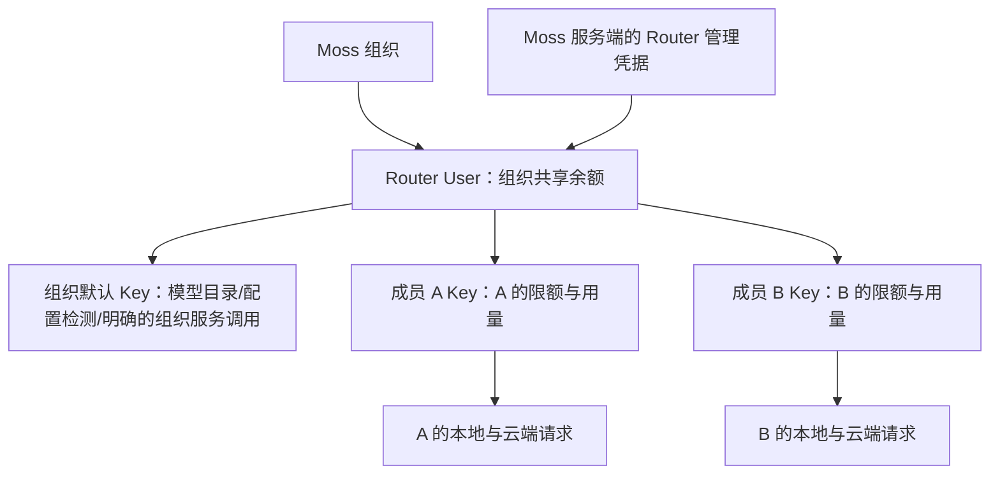

# 组织共享 SudoRouter 账户：现状核查与实施建议

日期：2026-09-29。状态：分析方案，尚未实施业务改造。

## 1. 核查范围与结论

已对 Moss 执行 `git fetch origin dev`、`git merge --ff-only origin/dev`，本地与远端均为 `21d8532d6d7d780d01c25855946625965e103c92`。现有未跟踪文件保留。

| 项目 | 本轮代码基线 | 核查方式 |
|---|---|---|
| Moss | dev / 21d8532 | 已同步远端；源码与相关现有测试 |
| SudoRouter（new-api） | sudo/rc24 / 4a0a94f9 | 用户指定目录的当前分支；源码与相关现有测试 |
| Sudowork | dev / 3e229eeb | 用户指定目录的当前检出源码 |
| 旧 sudowork-server | comac / d2f7fd4 | 后续按用户指定补查富友支付及 Router 调用；只读核查 |

Moss 之外的仓库未切分支或拉取更新。本轮没有查询生产数据库、调用真实开户/充值接口或核实线上部署版本。

最新金额口径已确认：**全面取消积分，模型余额、成员消费限额、费用及赠额统一按 USD 计价，富友实际支付仍为 CNY，内部使用整数 quota。** 该变化覆盖新业务字段、计算、API 和客户端，历史积分只保留为审计/迁移依据，详见第 12 节。

最新产品决策：新组织创建设置初始额度；后台创建成员可选择限额或不限额，邀请码注册继承组织默认设置。保留“限额”名称，充值与收费规则保持既有设计；公司共享余额符合目标，额度不足仅作简洁提示，不新增预警。此前评审建议的处置见[产品决策记录](/Users/yobach/VSCodeProject/moss/docs/plans/2026-09-29-organization-router-product-review.md)。

需求可以基于 Router 现有 User/Token 模型实现：**一个组织对应一个 Router User，组织默认 Key 和所有成员 Key 都属于该 User；实际余额由组织账户共享，成员 Key 负责消费归属及个人限额。**

但不能只把现有用户的 Router User ID 改成组织账户 ID。账户绑定、模型凭据选择、限额接口、用量隔离、充值审批和存量迁移都需要调整。Router 当前也有必须补齐的接口与隔离问题。

[主方案（初稿 2026-09-23，已于 2026-09-29 修订）](/Users/yobach/VSCodeProject/moss/docs/plans/2026-09-23-organization-router-account-member-token-design.md) 已同步最新业务边界：保留组织默认 Key，组织共享资金、成员仅有消费限额，取消新个人充值，富友仅供组织管理员给组织账户充值。初稿中的个人充值权益、企业预分配资金和充值双步骤设计已被替代。本文保留现状证据及具体改造位置，支付细节见第 11 节；两份文档均为未实施方案。

最新接口原则：已有接口保持原路径、参数、响应、鉴权及业务行为，并优先复用。创建组织 Router User、创建默认/成员 Key 和充值更新额度都有已有接口，不重复新增；此前 13 项清单及随后提出的独立充值接口均撤回，仅保留 3 项成员 Key 管理能力。组织充值复用 PUT /api/user/quota，与旧 sudowork-server 的实际支付链路一致。具体以 [接口复用与最小补充方案](/Users/yobach/VSCodeProject/moss/docs/plans/2026-09-29-sudorouter-integration-api-draft.md) 为准。Key 轮换、动态模式切换、完整事件账本等延后；旧日志访问范围带来的上线限制保留在第 7 节，不能通过只增加管理接口消除。

## 2. 现在的实际行为

| 入口/能力 | 当前实现 | 与目标的差异 |
|---|---|---|
| 原生创建组织 | `AuthService.createOrganization` 创建组织、配置档案、数字别名、本地钱包 | 不创建 Router 账户或默认 Key，也不自动绑定模型服务 |
| 兼容后台创建企业 | `OrganizationIdentityService → UnifiedIdentityService`；兼容入口默认本地 creditPool=10,000 | 同样不开户；10,000 本地积分不代表 Router 已到账 |
| 原生组织内创建人员 | `createProvisionedUser` 创建 pending 用户，调用账户服务后激活；依赖 Router 已配置 | 每个人单独创建 Router User |
| 原生邀请码注册 | 邀请码确定 orgId；创建用户后路由调用 `ensureGatewayAccount`；登录也可补开户 | 仍按用户开户；旧客户端开户回退分支还存在 |
| 兼容密码/短信注册、后台创建人员、CAS 建人 | 进入统一身份服务，再调用 `ensureAccount(ownerId=user.id)` | 每个人单独开户 |
| Router 开户服务 | `SudorouterAccountService` 固定写 `ownerType=user`；创建账户、处理初始额度、创建 Key | 组织账户/成员 Key 尚未拆开 |
| 创建 Key | Adapter 固定 `unlimited_quota=true`，仅返回 Key 字符串 | 不保存 Token ID，不能管理成员限额和生命周期 |
| 组织模型服务 | 已有按组织保存的模型设置、Provider 和秘密凭据 | 可复用配置存储；仍缺自动开户及凭据归属绑定 |
| 管理端人员列表 | 已显示 Router Key 掩码/状态，支持经权限校验和审计的复制 | 可扩展现有界面；尚无 Router Key 限额、停用、轮换闭环 |
| 个人/部门 Token 限额 | 已有 UI 和 Moss 云端运行前的检查 | 统计模型 Token 数，不是 Router 计费额度，也不能约束直接持 Key 调用 |

现有限额还有一处口径不一致：人员页面写“每日 Token 用量上限”，执行器实际读取所选会话的 `stats.summary.totalTokens`，没有按当天过滤；日/周/月趋势与 summary 是不同数据。不能把这个入口当作已经可用的每日金额预算。

Moss 本身的登录/API 访问密钥也有管理功能，它和 SudoRouter 模型 Key 是两类凭据，界面应明确区分。

## 3. 建议的账户与密钥关系



三类凭据的职责：

| 凭据 | 用途 | 交付范围 |
|---|---|---|
| 平台 Router 管理凭据 | 创建组织账户、创建/管理 Token、组织充值 | 仅 Moss 后端 |
| 组织默认模型 Key | 自动填入组织模型服务，用于目录发现、配置检测；需要时承担有明确归属的组织服务调用 | 服务端秘密存储；不作为普通成员的兜底 Key |
| 组织成员 Key | 该成员所有受管理的模型调用，记录其用量并执行个人上限 | 下发对应成员的 Sudowork/执行环境 |

默认 Key 是普通推理 Token，**仅在 Moss 中给它起“配置 Key”的名字，不会使它变成只读凭据**。当前 `/v1/models` 也走普通 TokenAuth，有限额且剩余为零的 Key 无法发现模型。因此建议给默认 Key 明确的服务预算，并把其消费单列为“组织服务”。本期不修改旧推理/目录接口，亦不承诺默认 Key 只读；若以后要求只读目录，则另行设计新能力及凭据隔离。连接测试若会实际推理，也要归入这笔预算。

成员自身包括组织管理员的正常对话，均使用各自成员 Key。默认 Key 的预算不应成为绕过成员限额的通道。

“所有模型共享一个账户”的前提是这些模型都通过这个 SudoRouter 服务。现有自定义 Provider 可以指向别的服务商，使用独立 Key，不能自动纳入 Router 余额。应明确标记受组织 Router 管理的 Provider，并把其他自带 Key 的服务显示为独立计费；若要求完全统一，就必须统一经过组织 Router 账户。

## 4. 开户和成员加入流程

### 创建组织

1. 有权限的后台操作者设置组织初始额度（USD），本地事务创建组织并持久化额度目标和 Router 开通任务；模型服务显示“开通中”。
2. 以 orgId 生成稳定、符合长度限制的 Router 用户名，初始密码取该 Router 账户名（不足 8 字符在末尾补 `1`），调用已有 POST /api/user/ 创建普通 Router User。组织更名不改变账户归属。
3. 保存组织 Router User ID，查询真实初始余额；沿用现有初始补额规则，已有赠额计入目标，仅用已有 PUT /api/user/quota 补不足部分，已超过目标不自动扣回。只在新账户尚无消费、凭据尚未开放时计算并保存一次差额；创建响应未返回 quota 不能当成零，登录/成员加入/恢复不按实时余额重新补齐，未知结果进入核对。
4. 调用已有 POST /api/token/，指定该 user_id 创建组织默认 Key，保存 Token ID、秘密引用和用途；自动写入该组织的模型服务 URL、协议、Provider 绑定及默认模型配置。
5. 完成账户和配置验证后置为可用，继续处理等待开户的成员任务。账户无资金时应显示“待充值”，不要混同为开户失败。

外部网络调用不放进数据库长事务。持久化步骤处理重复提交和 Moss 重启；“组织已创建”和“模型服务已开通”分开显示。旧创建接口没有完整业务幂等：账户可按稳定用户名核对，Key 创建超时或秘密丢失须进入“待核对”，停止盲目重发，必要时人工处理；首版不承诺所有异常自动恢复。现有原生创建组织虽然收取 idempotencyKey 字段，却未使用统一身份命令的幂等结果，接入时应一起收口。

### 后台创建成员 / 邀请码注册

1. 由服务端确定组织：后台以授权组织上下文为准，注册以邀请码所属组织为准。
2. 创建身份和成员关联，持久化成员 Key 开通任务。邀请使用状态继续保持原子性。
3. 读取该组织已有 Router 账户，调用已有 POST /api/token/ 并指定 user_id 创建成员 Token；不要再创建个人 Router User。
4. 后台建人可设置 USD 限额或选择不限额，未指定则继承组织默认设置；邀请码注册由服务端采用组织默认的有限/不限额设置，注册者不能自行提额。保存 Token ID 和 Key 秘密引用；默认设置只作用于新成员，不沿用“每新增成员给账户充值”的逻辑。
5. 向该成员返回/刷新运行凭据；组织账户未就绪时等待重试，展示原因。

原生/兼容后台、短信/密码注册、CAS/OAuth 首次建人、导入和登录补全都应使用同一账户模式。迁移或回放仍须禁止隐式开户；登录重试不能重建已停用 Key、恢复管理员冻结状态或补回已经消费的额度。

### 模型请求

现有本地 `buildClientRuntime` 已坚持只下发用户 Key；新版 Sudowork 在运行前刷新 `/api/v1/client/local-runtime`，按服务器+组织+用户隔离配置，Key 变化会清理旧 Worker，未就绪会清空托管模型配置，可以复用。

云端则必须调整：

- `runtimeService` 目前对 legacy-default 使用 `userModelKey || providerApiKey`，缺少成员 Key 仍可能消费默认 Key。组织共享模式下必须拒绝该请求并提示开通/恢复成员凭据。
- 现在成员 Key 只作用于 `legacy-default`；任意新增一个自定义 Provider 再填默认 Key，不会自动使用成员 Key。应引入明确的 Provider 凭据模式/组织账户绑定，统一模型发现与实际推理的解析。
- 凭据解析应接受 `(orgId, userId, providerId)` 并验证归属。现有 `getUserModelCredential(userId)` 从用户原属组织取 Key；超级管理员切换到其他组织时，不能因此把源组织 Key 用于目标组织会话。
- 身份禁用、退出/转组织、Key 停用要同步阻止 Router 新请求。仅让 Moss 登录失效，无法撤销已下发、可直连 Router 的 Key；已开始的请求要按既定结算规则处理。

## 5. 额度模型：限额不等于分钱

建议首版采用“组织共享余额 + 成员独立消费上限”，而不是为每个成员维护可提现的独立钱包。

| 概念 | 权威数据/处理 | 含义 |
|---|---|---|
| 组织可用余额 | Router User.quota；组织明确使用 wallet_only 或等效资金策略 | 真正可消费的共享资金 |
| 成员剩余限额 | 有限额 Token.remain_quota | 允许该成员继续从共享池消费多少 |
| 成员历史消费 | 该成员历代 Token 的结算记录 | Key 轮换后仍保留；不能只看新 Key.used_quota |
| 充值记录 | Moss 订单与组织入账操作 | 哪笔真实资金增加了组织余额 |
| 调整限额记录 | Moss 管理审计及 Router 原子额度操作 | 调整使用权，不是充值 |

例如组织模型余额 $100.00，A/B 各有 $80.00 的剩余限额，这是允许的共享池配置，不表示承诺了 $160.00 资金。A 消费 $50.00 后，组织余额 $50.00，A 剩余限额 $30.00，B 仍为 $80.00，但 B 最多只能使用当时池内可用资金。余额和限额是两重约束。

在无在途请求的静态快照中，成员可消费空间受 `min(组织余额, 成员剩余限额)` 约束；实际请求还受预扣、模型权限及并发等限制，这不是每人得到的保留资金。

具体规则：

- 组织充值：只增加组织资金；成员上限是否同时调整是另一项显式操作。
- 提高成员限额/批准更多使用量：只调整成员 Token，不增加组织余额。
- 一次成员消费：Router 扣组织资金，并同步减少有限额成员 Token 的剩余额度，是同一笔费用，不是两次收费。
- 成员“不限额”：只是不设个人上限，仍受组织余额约束。
- 调整“预算总上限”和“追加剩余额度”是两种操作；有历史消费时不能把新的总上限直接写成 remain_quota。
- 模型计费使用 Router 原始整数 quota，直接换算 USD；当前基准 1 USD=500000 quota，部署时核实。取消新业务积分换算；模型输入/输出 Token 数保持原单位，不同模型价格不同。

若要承诺“分配给 A 的资金别人不能使用”，则需额外的预留/分配账本及并发控制，此时才讨论可分配余额和成员权益总和。它不是共享池天然提供的能力。

首版支持创建时选择有限/不限额，有限额成员可追加/降低剩余限额；运行中切换模式及自动周期重置延后。成员管理 UI 保留“限额（USD）”，显示剩余值或“不限额”，不把总预算绝对值直接写成 remain_quota。月预算不是本期功能。

公司共享余额是用户明确选择的方式。组织余额或成员限额耗尽时显示“额度不足”，不新增低余额/突发消费告警或复杂引导；停用、开通中、网络失败等状态不因此改报为额度不足。

现有个人充值和积分审批需要按组织模式改造。尤其审批当前会给 Router User 加额，直接换成组织账户会变成“管理员提高个人上限时凭空增加组织余额”。依用户最新要求，不再提供新个人充值；支付入口改为组织管理员为组织付款，普通成员仅展示个人消费限额和用量，不能继续承诺独立个人余额。既有个人订单与资产保留历史并单独迁移。

## 6. 组织管理功能建议

建议在现有组织设置和人员页扩展，并提供组织范围的“模型账户”入口。

| 功能 | 首版内容 | 理由 |
|---|---|---|
| 组织账户概览 | 开通状态、组织余额、累计消费、余额同步时间、默认服务 Key 状态/服务消费 | 解释无余额、开户失败和成员无额度的不同原因 |
| 成员 Key | 成员关联、掩码、状态、创建时间、额度、可用模型；待核对任务、停用/恢复；沿用受控复制 | 一人一把有效消费 Key，便于限额及追踪；不盲目重试创建 |
| 成员限额 | 组织默认模板；创建时选有限/不限额；有限额 Key 追加/降低剩余额度，展示累计消费 | 限制个人使用共享资金的额度；不是给个人充值 |
| 用量明细 | 按成员、模型、时间查看；组织服务 Key 独立列示；成员只见自己的记录 | 对账和消费归属 |
| 生命周期联动 | 禁用成员、转组织、停用组织；记录失败/待同步状态 | 已发出的 Key 也必须受控制 |
| 管理审计 | 谁在何时开户、复制、停用、调整额度，含操作前后值 | 可追溯，审计中不存明文 Key |

后续再做 Key 轮换、动态策略/有限不限额切换、月预算、批量调整、告警、部门预算、成员自助创建多 Key、服务账号及账单导出。首版不建议成员任意创建多把 Key，否则“每 Key 限额”容易变成“每多一把 Key 多一份额度”；若需要多 Key，必须新增成员聚合预算，轮换时也不能重置成员消费历史。

普通成员无需理解 Router User 或管理凭据，只需看到“我的模型额度、已用量、状态”。组织管理员管理本组织，平台管理员按授权组织上下文操作；前端不接受任意 Router User/Token ID 作为可信归属。

## 7. Router 现状与实际需要补充的能力

现有接口优先复用；新能力放独立路由，不修改旧接口或公共实现使旧行为发生变化。新增契约以接口文档为准，本节只说明取舍。

| 能力 | 当前源码结论 | 本期处理 |
|---|---|---|
| 创建组织 Router User | POST /api/user/ 可用，响应返回 id/username | 直接复用；Moss 保存组织绑定，查询已有赠额后按创建配置用原 PUT 补初始额度 |
| 查询/停用/恢复组织账户 | GET /api/user/:id、POST /api/user/manage 已存在 | 直接复用，不新增账户详情/状态接口 |
| 在组织账户下创建 Key | POST /api/token/ 支持管理员指定 user_id、有限额、有效期、模型限制，返回 id/key | 直接复用；Moss Adapter 保存已有 Token ID 和秘密引用 |
| 成员读取额度 | GET /api/usage/token/ 可用，成功字段为 code:true；人工停用 Key 无法读取 | 成员可复用；管理员查询走新增 N01 |
| 管理员查询组织 Key | 原列表/详情按当前认证 User 的所有权过滤 | N01 提供指定账户的分页查询和 token_id 精确过滤，含停用/耗尽/过期，不返回明文 |
| 停用/恢复成员 Key | 旧接口不支持管理员跨账户编辑，status_only 还会完整写回 remain_quota | N02 只改状态、同步缓存，不覆盖并发消费；旧接口不动 |
| 调整成员限额 | PUT /api/token/ 是绝对值编辑，不能安全实现并发消费时的追加 | N03 原子 delta，持久化去重，只改成员剩余限额 |
| 组织充值 | PUT /api/user/quota 已可加减账户余额；旧服务富友回调正是调用它 | 直接复用，Moss 改组织收款绑定与订单处理；未知入账结果核对后处理，不盲目重发 |
| 基本消费明细 | 管理员 GET /api/log/ 有 user_id/token_id；当前 Moss 用的 /api/log/query 信息不足 | Moss 改为复用管理员日志并验证组织、按 Token 映射；不强制新增完整事件接口 |
| 成员日志隔离 | /api/v1/logs/ 用 Key 认证，却只强制 UserID，未强制 Token ID | 旧接口不变；此问题是独立上线限制，不是新增日志接口即可消除 |

N01 中的 token_id 筛选查询的是 Key 状态、限额及累计用量，不是日志列表。本期基本日志复用管理员 GET /api/log/，由 Moss 按可信 Token ID 过滤；即使另加 Token 日志查询，也不会改变旧 /api/v1/logs/ 对真实成员 Key 的访问范围。这是“页面返回正确”与“旧入口仍可越权”的区别，不增加本期接口数量。

内部 IncreaseTokenQuota 是消费退款函数，会增加 remain_quota、减少 used_quota；不能包装成成员追加限额。新限额命令不改变历史消费和组织余额，并区分人工冻结与额度耗尽，不能调限额就解除人工冻结。

Key 轮换、动态模式/策略编辑、周期预算、幂等发 Key 和完整增量事件同步均延后。首版创建时确定模式，有限额 Key 支持追加/降低；旧发 Key 超时须核对，不能用名称当唯一标识或假定能自动重试。

兼容约束下的未解决问题：真实成员 Router Key 下发 Sudowork 并可直连既有 Router 时，旧日志接口仍能查询账户范围日志。旧接口完全不变、原始 Key 直连、成员日志严格隔离目前不能同时实现。可另行采用不暴露真实 Router Key 的受控推理代理，但这会改变当前本地直连架构，不是本期既定实现。仅增加一个屏蔽日志的域名不够，持真实 Key 仍可能绕到其他可达入口。

其他边界：

- Router 原子预扣后仍可能因最终补扣产生负数，高额度信任模式还可能跳过预扣。当前能做消费限额，不能宣称绝不超额。
- 当前资金偏好默认 subscription_first；组织余额池须确认 wallet_only 或等效配置，不能把订阅消费算成钱包扣减，也不为此重复新增开户 API。
- 每账户默认最多 1,000 把 Token，默认 Key 和成员 Key 都占名额；账户限流按全组织聚合，需按规模配置。
- 基本日志通过可信 token_id 映射成员，向成员返回前过滤；组织总条数或当前页过滤数不能冒充成员全量统计。不同后端（尤其 ClickHouse）的展示 ID、日志保留期和退款记录限制，使现有接口不能被承诺为永久、无遗漏的金融事件账本。

## 8. 数据结构与存量切换

建议保留当前 `billing_external_accounts` 表承载组织账户，使用 `ownerType=organization`。它已有 `(provider, external_account_id)` 唯一约束，不能给所有旧 user 行重复写同一个 Router User ID。

新增组织成员/服务 Token 绑定，至少保存：orgId、userId（服务 Key 可空）、用途、routerUserId、routerTokenId、秘密引用、状态、创建与停用时间。按组织+用户约束一把有效成员 Key；消费历史映射保留旧 Key。此业务绑定由 Moss 维护，不要求 Router 增加 external_ref 表。

账户/Token 编排操作保存稳定操作号、步骤和外部结果；只发送 Idempotency-Key 请求头不代表 Router 已实现幂等。Moss 已有开户任务、claim、outbox 和秘密存储机制，可复用设计，但需扩展组织账户与成员 Token 两个领域。

存量建议显式区分 `legacy_personal` 与 `organization_shared`，按组织切换：

1. 盘点该组织所有原个人账户、Key、余额、欠费、在途结算和未完成订单，保留现有账单归属。
2. 开组织账户与新成员 Key，验证限额、用量和模型配置；迁移准备期间不启用双路消费。
3. 对原余额确定迁移/退款/保留规则，用可审计、可恢复的资金操作处理；不能简单把旧余额汇总后给组织加一次钱、又保留旧 Key 继续花。
4. 切换凭据解析并刷新 Sudowork/云端运行环境，撤销原 Key 的后续消费能力；处理在途结算。
5. 对账后完成切换，旧账户和映射保留历史；迁移完成的成员缺 Key 时不能再回退到旧个人账户。

这是同一个新功能的迁移阶段，不应在本轮分析里直接转移生产资金。原个人充值余额的归属尤其不能默认为可被组织其他成员消费。

## 9. 推荐实施顺序与验证

1. 复用已有开户/发 Key/账户管理/充值能力，仅补齐 3 项成员 Key 管理接口，保持所有旧接口不变；同时明确旧日志入口与原始 Key 直连的隔离边界，未解决前不启用共享模式。
2. Moss 增加组织账户/成员 Token 绑定与统一开通编排，串起所有组织/成员创建入口。
3. 统一受管理 Provider 的成员凭据解析，去掉共享模式下的默认 Key/旧 Key 回退；补组织身份检查。
4. 扩展组织账户概览、人员 Key/额度管理、成员用量，分离充值与调整上限。
5. 验证本地/云端/组织服务调用，再按组织迁移存量。

验收至少覆盖：重复本地提交不重复执行已完成开通步骤，旧创建接口超时进入核对、不盲目重发；新增成员管理命令用原业务标识重试只生效一次；充值已到账不重发，结果未知进入待核对；两个成员 Key 属于同一个 Router User；成员消费只计入自己并减少共同余额；A 耗尽不影响有余额且未耗尽的 B；组织余额不足时所有成员被正确限制；缺 Key 不回退；默认 Key 消费单列；停用后直连 Key 不再可用；A 的 Key 无法查询 B 日志；跨组织管理不能用错 Key；个人充值/审批按新语义执行。轮换和模式切换不属于首版验收。

这里的日志隔离是完整共享模式的上线验收，不表示本期仅新增管理接口即可达成。新增接口还须证明未改变旧接口契约；本轮只更新文档，没有执行兼容回归或实现任何接口。

本轮实际验证：

- Moss 5 个相关 Node 测试文件，21 项通过：开户服务、Adapter、兼容注册开户链路、凭据读取/复制权限、原生统一创建。
- `bun test src/server/__tests__/clientRuntime.test.ts`：5 项通过，覆盖本地凭据及共享 Key 不下发。
- Router 选定 4 项现有测试通过：Token 读取掩码、更新掩码、取明文 Key 的所有权、无 Redis 的账户/Token 原子预扣；测试使用隔离数据库。
- 本轮未新建功能测试，未改业务代码。上述测试证明当前基础行为，不代表拟议共享账户功能已实现；日志越权和状态更新竞态本轮按源码确认，历史文档的复现结果不计入本轮测试。

## 10. 主要源码位置

| 主题 | 位置 |
|---|---|
| 原生组织创建/成员创建 | [auth/service.ts](/Users/yobach/VSCodeProject/moss/src/server/auth/service.ts:1733)、[createProvisionedUser](/Users/yobach/VSCodeProject/moss/src/server/auth/service.ts:2164) |
| 邀请注册/补开户 | [registerWithPhone](/Users/yobach/VSCodeProject/moss/src/server/auth/service.ts:995)、[ensureGatewayAccount](/Users/yobach/VSCodeProject/moss/src/server/server.ts:1491) |
| 兼容企业/成员入口 | [adminService.ts](/Users/yobach/VSCodeProject/moss/src/server/api/compat/sudowork/adminService.ts:104)、[identityService.ts](/Users/yobach/VSCodeProject/moss/src/server/api/compat/sudowork/identityService.ts:241) |
| 当前个人开户和 Key 契约 | [sudorouterAccountService.ts](/Users/yobach/VSCodeProject/moss/src/server/billing/sudorouterAccountService.ts:59)、[sudorouterAdapter.ts](/Users/yobach/VSCodeProject/moss/src/server/billing/sudorouterAdapter.ts:199) |
| 组织模型设置/Key 选择 | [systemSettings.ts](/Users/yobach/VSCodeProject/moss/src/server/systemSettings.ts:625)、[modelListCache.ts](/Users/yobach/VSCodeProject/moss/src/server/modelListCache.ts:22) |
| 云端凭据回退 | [runtimeService.ts](/Users/yobach/VSCodeProject/moss/src/server/runtimeService.ts:2196) |
| 本地模型凭据 | [clientRuntime.ts](/Users/yobach/VSCodeProject/moss/src/server/clientRuntime.ts:26)、[mossLocalRuntime.ts](/Users/yobach/VSCodeProject/sudowork/apps/desktop/src/process/services/mossLocalRuntime.ts:39) |
| 管理端 Key/Token 限额 | [users-page.tsx](/Users/yobach/VSCodeProject/moss/admin/src/pages/users-page.tsx:1347)、[限额 UI](/Users/yobach/VSCodeProject/moss/admin/src/pages/users-page.tsx:2136)、[限额执行](/Users/yobach/VSCodeProject/moss/src/server/runtimeService.ts:574) |
| 积分审批/旧用量归属 | [creditApplicationService.ts](/Users/yobach/VSCodeProject/moss/src/server/billing/creditApplicationService.ts:105)、[legacyUsageService.ts](/Users/yobach/VSCodeProject/moss/src/server/api/compat/sudowork/legacyUsageService.ts:146) |
| Router 代建 Token/状态更新 | [controller/token.go](/Users/yobach/VSCodeProject/new-api/controller/token.go:300)、[model/token.go](/Users/yobach/VSCodeProject/new-api/model/token.go:310) |
| Router Key 日志隔离 | [controller/v1/logs.go](/Users/yobach/VSCodeProject/new-api/controller/v1/logs.go:85) |
| Router 结算/预扣 | [billing_session.go](/Users/yobach/VSCodeProject/new-api/service/billing_session.go:42)、[quota_reserve.go](/Users/yobach/VSCodeProject/new-api/model/quota_reserve.go:208) |

## 11. 用户补充确认：成员仅限额，富友充值归组织

业务边界已明确：**全面取消积分及新个人充值；组织持有 USD 模型余额，成员只有 USD 消费限额；富友人民币支付保留，仅组织管理员在 Sudowork 为组织账户购买模型额度。** 以下是设计修订，尚未修改业务代码。

### 功能保留与替换

| 现有功能 | 组织共享模式下处理 |
|---|---|
| 用户列表的“积分调整” | 改为“限额调整（USD）”，直接换算 quota 调整成员 Token；取消纯本地个人余额调整及“是否同步 SudoRouter”选项 |
| 用户列表的“后台充值” | 移除给个人加钱的入口；旧个人资金写接口对共享组织拒绝，不只隐藏按钮 |
| 个人余额同步 | 改为成员限额/消费查询；不能把组织余额同步到每个人的钱包 |
| 普通成员充值中心 | 不显示，直接访问页面和调用组织充值 API 同样拒绝；个人用量/限额移到个人中心保留 |
| 组织管理员充值中心 | 保留富友套餐、支付二维码、订单查询；展示当前组织名称、组织余额、组织消费及组织充值订单，付款管理员作为操作人记录 |
| 原积分申请/审批 | 不沿用“审批给账户加钱”；共享模式关闭旧入口。若后续保留申请功能，改成申请提高消费限额，不改组织资金 |
| 后台订单管理 | 保留组织订单、支付状态、到账补偿/重试、对账、审计，以及有独立授权的退款处理 |
| 后台手工加资金 | 日常个人充值入口移除；不因保留订单运维而默认新增一个管理员可随意给组织加钱的功能 |

不能删掉整个 Router 额度接口层：成员限额调整仍调用 Token 额度接口；富友确认成功后仍调用 User 资金接口。应删除/禁用旧的个人资金用途，复用可靠的支付、外部操作和对账基础设施。

### 支付链路与资金归属

```text
当前组织管理员 → 创建组织充值订单 → 富友支付
                                      ↓
                        Moss 校验回调/主动查单结果
                                      ↓
                    PUT /api/user/quota 更新组织 Router User 余额
                                      ↓
                         组织账单记账、标记额度已到账
```

付款人不等于收款账户。下单时由 Moss 从登录身份与组织绑定确定并保存：

- `billing_scope=organization`、`org_id`、组织 Router 绑定 ID 与 `router_user_id`。
- `payer_user_id`、下单时授权记录、订单号、购买/赠送 USD 定点金额、人民币实付分、credited_quota、汇率及定价/赠送规则快照。
- 支付状态与 Router 到账状态分开保存，关联稳定的组织入账业务操作号。

客户端不能自行指定收款 Router User；支付回调、补单、重试、退款都使用订单原绑定，不能通过付款人的当前组织/当前成员 Key 重新查收款账户。组织换绑也不能让老订单静默转给新账户，必须按明确迁移规则处理。

支付校验成功才开始组织入账，继续调用旧 PUT /api/user/quota。Moss 先持久化支付确认和入账尝试，用数据库级订单排他处理归并回调、查单和补单；已确认到账不重发。远程请求超时、进程中断或远端成功后本地落库失败显示“支付成功，组织额度到账待核对”，不能自动再次加额。只有可确认未发送/未生效才能重试，未知结果保留原尝试并核对外部证据，必要时人工处理。comment 中的订单号是审计备注，不是远端幂等键。

例如管理员购买 $10.00 模型额度、赠送 $1.00，组织余额增加 $11.00（5500000 quota）；示例汇率 7.30 时人民币实付为 ¥73.00。管理员自身和其他成员的限额均保持不变。支付行为不解除人工冻结、不过期恢复 Key，也不自动启用已停用组织。

付款成功后的验证、入账和对账属于服务端订单处理，不要求付款管理员仍在线或仍有管理员角色。已发出的有效支付二维码可能在角色撤销后完成付款，仍须按固化订单入账或进入明确的退款/异常处理，不能丢弃已收款事件。

### 权限与界面

只有当前组织经服务端确认的组织管理员具有组织充值能力。普通成员、部门管理员没有该能力；平台超管身份不能单凭客户端角色字符串被视为当前组织付款人，平台运维权限与组织充值资格分开。

建议在登录后/当前身份接口返回 `billing.scope=organization`、`billing.organization_id`、`billing.can_recharge`、`billing.can_view_organization_orders`。这些是拟新增字段，由 Moss 的真实角色、组织状态、支付开关及组织账户就绪状态计算；界面不自行拼接大小写混杂的旧角色枚举。无权限为拒绝，能力未加载时不乐观展示入口。

必须覆盖四层：充值菜单、直接打开充值页面、下单/发起支付 API、组织订单/余额读写权限。组织管理员看到本组织订单及付款人记录，权限撤销后下一次请求即拒绝；不能只让每个管理员看到自己付款的个人订单列表。

套餐/能力显示可复用现有配置，但普通用户不应获得组织账单和收款操作权限。服务端富友回调继续通过支付协议校验，不套用交互式管理员登录门禁。

### 本轮核实的具体改造点

- [Sudowork 充值菜单](/Users/yobach/VSCodeProject/sudowork/packages/renderer/src/layouts/components/SettingsSider.tsx:137) 目前只按 recharge_mode 隐藏；[路由](/Users/yobach/VSCodeProject/sudowork/packages/renderer/src/router.tsx:113) 只限制游客。[充值页](/Users/yobach/VSCodeProject/sudowork/packages/renderer/src/pages/settings/recharge/index.tsx:58) 仍读取个人 dashboard，须改组织视图。
- [原生充值下单/支付](/Users/yobach/VSCodeProject/moss/src/server/server.ts:6355) 没有组织管理员门禁；[兼容充值路由](/Users/yobach/VSCodeProject/moss/src/server/api/compat/sudowork/billingRoutes.ts:30) 也只要求登录用户。两条路径都须收口。
- [统一支付结算](/Users/yobach/VSCodeProject/moss/src/server/billing/rechargeService.ts:343) 仍按 user owner 找 Router 账户；[原生旧支付结算](/Users/yobach/VSCodeProject/moss/src/server/credits/recharge.ts:359) 仍通过付款 userId 解析账户，两处都要改为固化组织目标。
- [积分调整/后台充值](/Users/yobach/VSCodeProject/moss/src/server/api/compat/sudowork/billingService.ts:354) 当前修改个人钱包或个人 Router 余额；不能简单更换 externalUserId 后保留原业务。

历史处理：禁止新个人充值不等于删除旧订单、个人余额或旧支付回调。切换前处置未完成个人订单；仍有可能支付/回调的历史订单按原 billing_scope、原收款绑定处理或退款，避免把历史个人支付无提示转入组织资金。已确认旧流程退役后再删除不再使用的写代码。

新增验收：成员看不到充值中心且直接调用被拒；组织管理员只给当前组织下单；同组织其他授权管理员可查看组织订单；跨组织不可查/付；角色撤销不丢已收款事件；充值不提高任何成员上限；重复回调/查询/补单不重发已到账订单，结果未知须核对后处理；旧个人积分写入口对共享组织无效；存量订单不改归属。

### 补查旧 sudowork-server：可复用的支付与 Router 调用

旧服务当前分支 comac、提交 d2f7fd4。已按用户指定查看源码，未运行真实支付或变更该项目。

| 旧实现 | 源码证据 | 组织共享模式处理 |
|---|---|---|
| 富友支付回调 → 充值处理 | [recharge.ts](/Users/yobach/VSCodeProject/sudowork-server/src/routes/recharge.ts:98)、[handleCallback](/Users/yobach/VSCodeProject/sudowork-server/src/services/RechargeService.ts:239) | 保留支付业务链路；Moss 下单/支付入口加组织管理员权限 |
| 成功后调用现有 Router 额度 API | [processRecharge](/Users/yobach/VSCodeProject/sudowork-server/src/services/RechargeService.ts:326)、[updateUserQuotaWithLog](/Users/yobach/VSCodeProject/sudowork-server/src/services/SudorouterService.ts:440) | 继续 PUT /api/user/quota，传组织账户 id、正向 quota 和订单 comment；无需新增 Router 接口 |
| 旧订单及个人账本 | [recharge_orders](/Users/yobach/VSCodeProject/sudowork-server/src/db/schema.ts:162)、[个人余额写入](/Users/yobach/VSCodeProject/sudowork-server/src/services/RechargeService.ts:355) | 旧订单虽含 enterprise_id，入账仍动态读个人 sudorouter_user_id；新订单固定组织收款绑定，不再增加个人钱包 |
| 后台重试、主动查单同步 | [retryFailedOrder](/Users/yobach/VSCodeProject/sudowork-server/src/services/RechargeService.ts:542)、[syncOrderStatus](/Users/yobach/VSCodeProject/sudowork-server/src/services/RechargeService.ts:1004) | 保留订单运维用途，恢复时统一检查入账状态；未知远程结果不能直接再次 PUT |
| 注册赠额、后台个人充值、积分审批 | [AuthUserService](/Users/yobach/VSCodeProject/sudowork-server/src/services/AuthUserService.ts:238)、[admin/points](/Users/yobach/VSCodeProject/sudowork-server/src/routes/admin/points.ts:211)、[CreditApplicationGrantService](/Users/yobach/VSCodeProject/sudowork-server/src/services/CreditApplicationGrantService.ts:51) | 这些用途也调用同一资金接口；组织模式停止“每新增成员就加资金”和个人加钱，成员预算改 Token 限额 |

旧回调会检查 SUCCESS 订单并使用本地事务，但 Router 调用发生在本地提交之前；本地回滚不能回滚远程余额。因此它已有“完成订单跳过”机制，却不具备跨系统任意失败都安全重试的保证。此边界应通过 Moss 持久化入账状态、停止未知结果的自动补发及对账处理，不再把新增 Router 充值接口列为本期依赖。

## 12. 全面取消积分：数据、计算与客户端改造

此为用户确认的最终范围，不仅替换页面文案。组织模型余额、成员限额、模型费用、购买和赠送额度均按 USD 表达；支付订单的人民币实付与模型额度区分。主方案第 2、3、11、12 节定义单位、精度、API、迁移和验收，接口文档给出 USD 对应 quota 示例。

### 已核实的现状与改造

| 位置/现状 | 需要改造 |
|---|---|
| [rechargeService.ts](/Users/yobach/VSCodeProject/moss/src/server/billing/rechargeService.ts:14) 套餐含 points/bonus，按美元先生成积分再乘 500 | 套餐改 USD 购买金额与 USD 赠额；直接计算到账 quota，保留已生效优惠的等值金额，不因取消积分取消或扩大奖励 |
| [billingSchema.ts](/Users/yobach/VSCodeProject/moss/src/server/billing/billingSchema.ts:53) 套餐/订单强制 points_units，bonus_units 是旧积分单位 | 新结构/版本移除新订单对积分必填列的依赖；保留购买/赠送 USD 微单位、CNY 分、quota 与换算快照，不填假积分维持约束 |
| [sudorouterAdapter.ts](/Users/yobach/VSCodeProject/moss/src/server/billing/sudorouterAdapter.ts:67) pointsToQuota / quotaToPoints 且显示积分取整 | 新业务只用直接 USD↔quota 转换，原函数仅留一次性迁移/历史读取所需范围；不得经已取整积分反推真实余额 |
| [billingCoordinator.ts](/Users/yobach/VSCodeProject/moss/src/server/billing/billingCoordinator.ts:58)、原生 credits 支付/用量及钱包/账本 | 去除 points 作为执行单位；模型账以 quota 计，支付账以 CNY 分计，不再维护新个人积分钱包或重复扣款 |
| [fuiouAdapter.ts](/Users/yobach/VSCodeProject/moss/src/server/billing/fuiouAdapter.ts:70) 已发送 order_amt 为人民币分 | 支付协议不变，回调校验订单 CNY 分；页面明确 USD 模型额度与人民币实付 |
| 登录、Dashboard、成员页、组织概览、套餐/订单、导出、通知及兼容 Sudowork 响应 | 全部使用明确 USD/CNY 字段；新客户端无积分展示/输入/配置，费用明细保留小数精度；模型 Token 数显示不变 |

### 单位与迁移约束

当前 1 USD=500000 quota，1 quota=$0.000002；实际部署须确认该系数。模型余额/限额和消耗以 quota 为权威整数，USD 是直接派生值；购买及赠送存整数微美元，CNY 实付存整数分。充值/人工限额输入首版按两位 USD 小数校验，实际费用不逐笔舍入到美分；非零小额余额不能被显示为耗尽。

人民币应付按购买 USD 与订单汇率计算、四舍五入到分后固化；例如无赠送购买 $10.02、汇率 7.30 得 ¥73.146，实付为 7315 分，模型到账仍为 5010000 quota。回调按固化人民币金额核验，不用实付舍入结果或最新汇率重算美元额度。

Moss 新字段可使用 model_balance_usd、remaining_limit_usd、used_amount_usd、purchase_amount_usd、bonus_amount_usd 等明确含义，USD API 值使用定点字符串；旧 points 字段不可原地改成 USD 欺骗旧客户端。采用明确的新契约/版本，组织模式启用前升级客户端；旧积分写请求拒绝，不保留长期积分投影。Router 原 API 不改，新增接口仍只有 3 项 Key 管理。

迁移保留旧记录、原单位、转换依据、原始订单和审计链，不直接改写不可变账本。已有 Router quota 优先保留；仅有旧积分时按原规则换算（核实的旧标准 1000 积分=$1）。例如历史10000积分映射为$10.00，不是再次增加5000000 quota。赠额、购买、实付款和退款来源分别保存；汇率调整不重算历史余额及订单，历史个人资产不因去积分自动归组织。

完成条件：新套餐、订单、账本、API、客户端及导出均无积分依赖；购买$10、赠送$1、示例汇率7.30时，实付7300分、到账5500000 quota，成员限额不变；1 quota及多笔微额消费累计精确；单位迁移和回调恢复不触发重复加钱。历史审计/迁移中的“积分”字样可保留，产品新业务不再使用。
