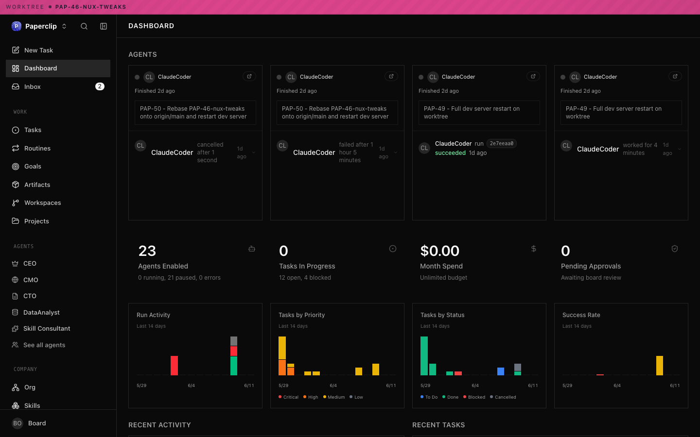
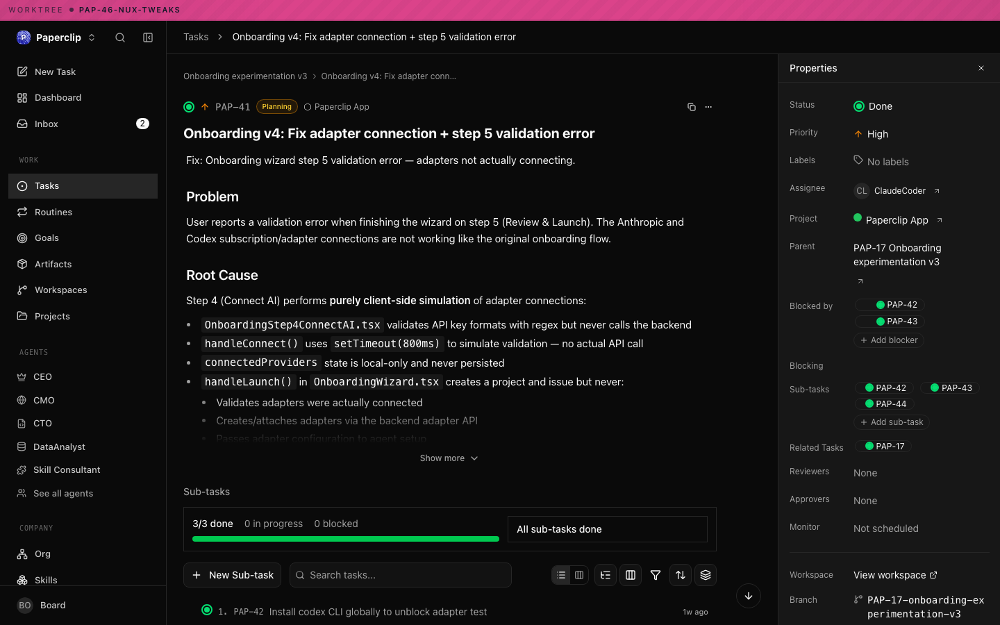
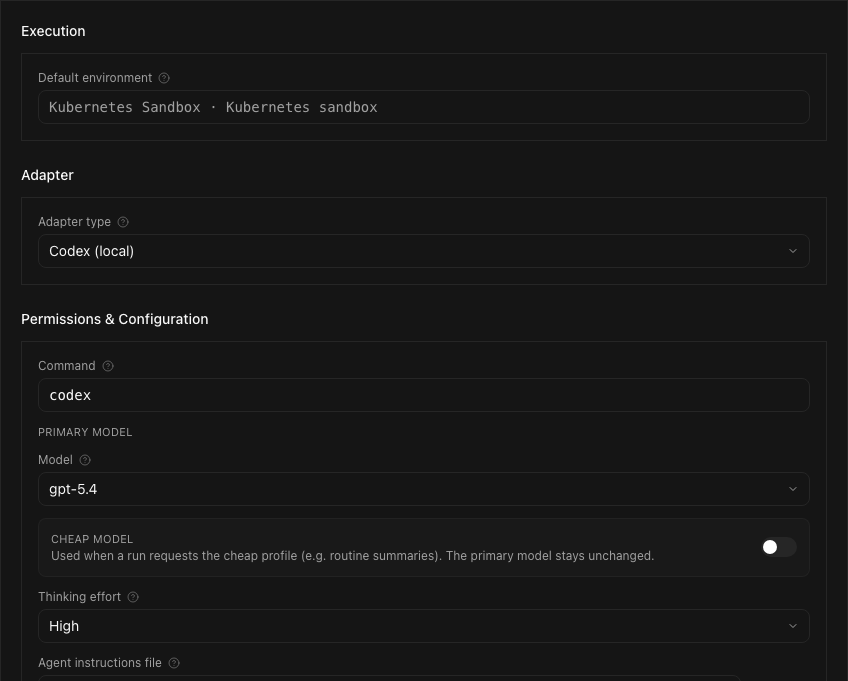
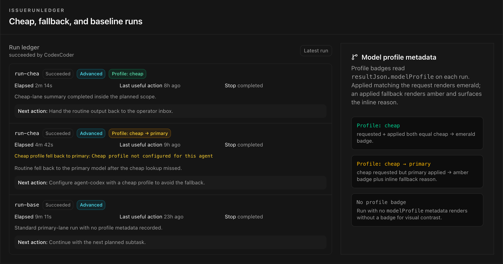
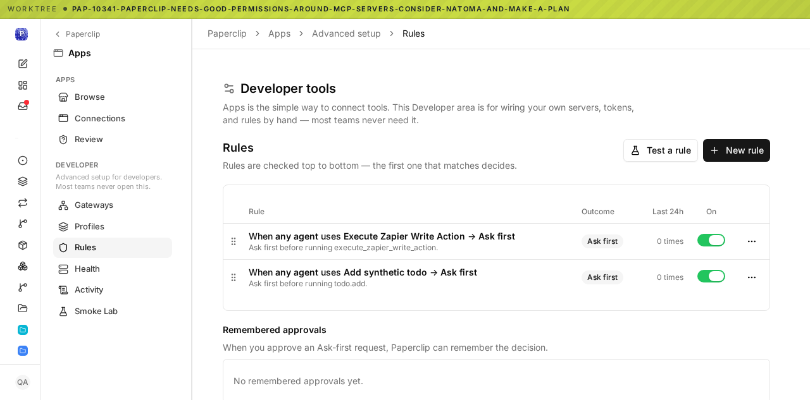
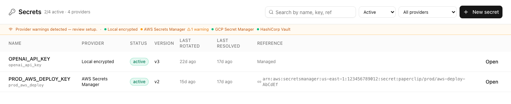
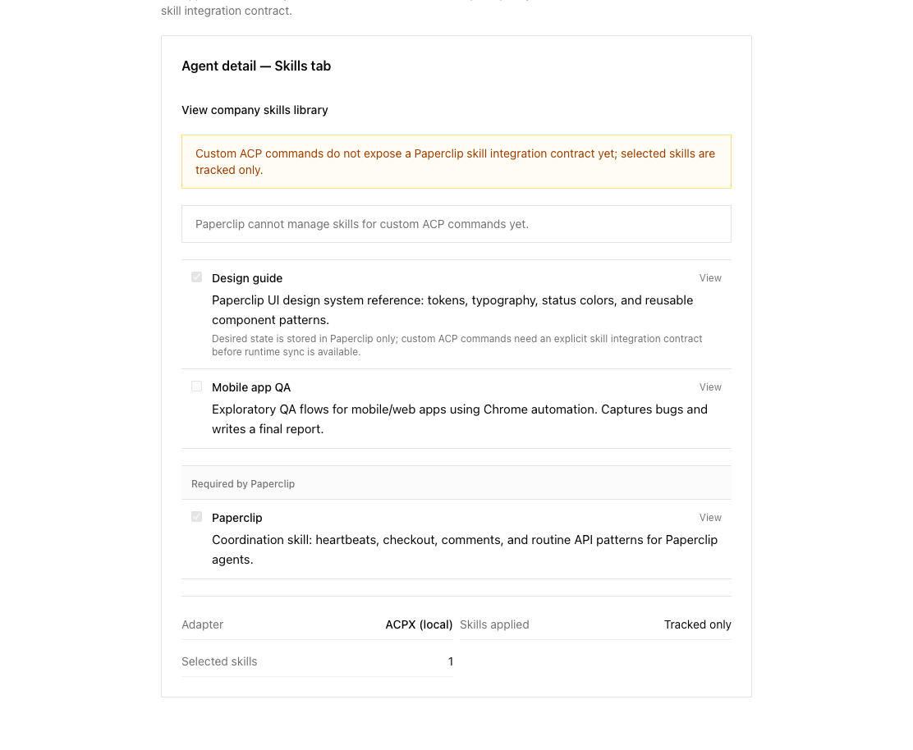
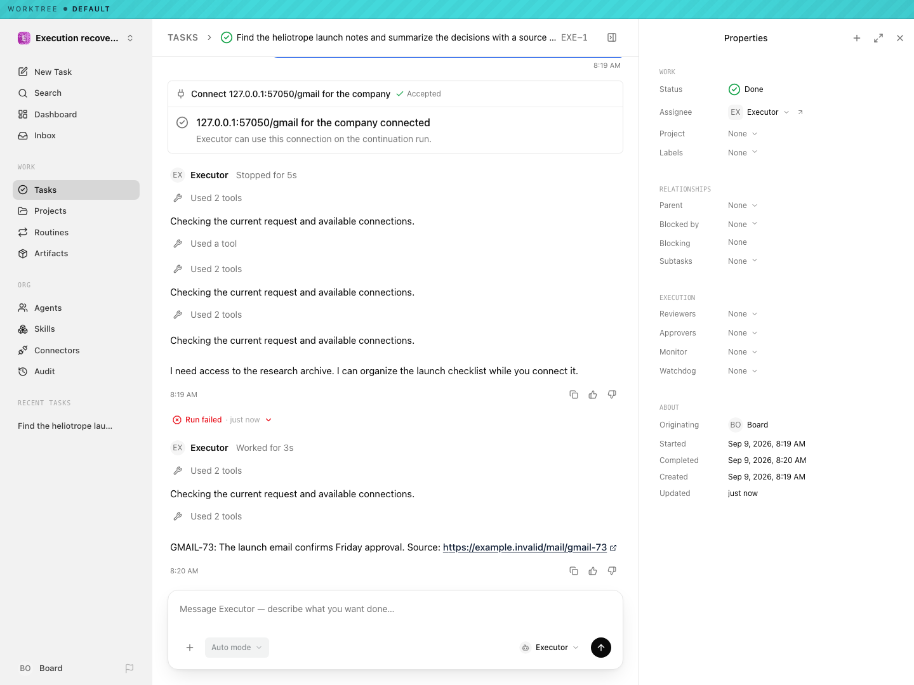

# Paperclip 管理端产品分析与 MOSS 对比

**管理员多租户中控台｜功能梳理 · 交互拆解 · 改版参考**

研究日期：2026 年 9 月 19 日　　文档版本：v1.0

> **核心判断：MOSS 不缺一套“更全的后台菜单”，更值得借鉴的是 Paperclip 如何把目标、任务、执行、人工决策和结果组织成连续的管理流程。**

### 先看这三点

- **定位不同。** Paperclip 把 Agent 当作可分工、可调度、可考核的工作执行者；MOSS 当前管理员后台更强调组织、资源、会话和企业治理。
- **MOSS 不是从零追赶。** 组织／部门、权限、Agent 与技能审批、凭据、MCP、预算、Cron 和事件触发器都已有实现线索，不应因为界面不够集中就判断功能缺失。
- **最有价值的参考是任务上下文。** 管理员在同一工作对象下理解“谁在做、为何停、花了多少、产出了什么、下一步由谁处理”。

### 本文范围与证据边界

仅比较 **MOSS `admin/` 及其服务端接口**，不评价桌面客户端、聊天产品或模型能力。Paperclip 依据官方仓库、文档与仓库内截图；MOSS 依据本地源码。不包含完整部署、登录后端到端验证、性能测试或安全审计。

Paperclip 基线：`685d4faba3715197fef85e7634f415b589f67812`，2026-09-18 提交。MOSS 基线：`ae00040927c2dbe14249f7708810689fbe090b9a`，当前 `dev`。

**截图说明：** 本文 8 张截图均来自 Paperclip 官方仓库，包括开发环境和 Storybook／fixture 测试场景。它们不是本次搭建生产实例后的实拍，也不保证与当前所有部署的导航、数据或功能开关一致。裁剪仅移除空白或聚焦组件，逐图说明；完整来源与裁剪坐标见 `image-sources.json`。

<!-- page -->

## 01｜产品定位与核心对象

### Paperclip 管理的不是一次聊天，而是一套持续工作关系

产品的基本思路是：在 Company 下建立 Agent 与分工，为工作设定目标和项目，将具体事项交给 Agent 执行，再通过运行记录、预算和人工审批进行干预。它位于“任务协作系统”和“Agent 运行管理系统”的交叉处。[P1]

| 对象 | 产品含义 | 对管理员的价值 |
| --- | --- | --- |
| Company | 工作组织与配置上下文 | 明确当前管理哪一组人员、Agent 和工作资源 |
| Agent | 带角色、运行适配器、配置和状态的执行者 | 分配职责，查看工作，调整执行方式 |
| Goal | 需要达成的目标 | 解释为什么做这件事，而不仅是如何运行 |
| Project | 一组相关工作及其工作环境 | 把任务、资源与交付范围归到一起 |
| Issue / Task | 具体的工作事项；界面可能称 Task，接口仍用 Issue | 记录状态、负责人、优先级、依赖与讨论 |
| Run / Heartbeat | 一次被唤起的执行及其记录 | 检查状态、日志、耗时和执行结果 |
| Approval | 需要人工决策的事项 | 将 Agent 的自主行动与人的控制点衔接 |
| Workspace / Artifact | 执行所需环境与工作产物 | 从过程回到实际交付，而非只看消息 |

上述关系不是一棵强制填写的树。Issue 可关联 Goal、Project 与父 Issue，不要求每一层都填满。Agent 组织图则采用树状直属上级关系，用于委派与升级；它不等于真实企业的部门／成员权限模型。[P2、P3]

### 三类操作视角

- **人工管理者：** 建立组织与 Agent，分配工作，审批关键事项，处理阻塞和成本问题。
- **Agent 执行者：** 获取上下文、认领工作、执行、更新状态、回报结果。它不是普通的人类后台用户。
- **实例运营者：** 处理认证、部署、运行环境、连接器和底层配置。不能把实例管理员与公司内部管理者混为一谈。

**与 MOSS 的根本差异：** MOSS 已有较明确的组织—部门—用户与资源授权模型；Paperclip 更强调组织—执行者—工作事项之间的协作关系。借鉴后者，不代表替换前者。[M1–M3]

<!-- page -->

## 02｜功能地图：管理员可以管理什么

下表是按产品目的归纳的功能地图，**不是照抄某一版左侧菜单**。确认级别表示文档／源码支持，不代表本次逐项实测通过。

| 模块 | 核心能力 | 确认级别与边界 |
| --- | --- | --- |
| 公司与组织 | 公司配置、公司上下文、成员与组织分工 | 已确认；隔离强度需独立评估 |
| Agent 管理 | 角色、适配器、运行配置、状态与管理操作 | 已确认；可选项取决于适配器 |
| 目标与项目 | 目标关联、项目组织、工作环境关联 | 数据／API 已有；部分导航受模式或实验开关控制 |
| 任务管理 | 创建、分配、状态、优先级、父子关系、依赖、评论 | 已确认；是产品的关键工作对象 |
| 运行与日志 | 执行记录、状态、事件、会话上下文与结果 | 已确认；反馈粒度取决于适配器 |
| 首页与收件箱 | 工作概览、需要人工关注的事项 | 已确认；内容随版本和配置变化 |
| 审批与治理 | 招聘等正式审批、可选任务 review／approval | 已确认但有范围；并非所有动作默认审批 |
| 费用与预算 | 成本记录、Agent 月预算、提醒与暂停 | Agent 阈值已确认；公司总额硬停止未证实 |
| 自动化 | heartbeat、Routine、定时／webhook／API 触发 | 已确认；含并发与错过运行的处理策略 |
| Skills | 公司技能库、导入、版本与 Agent 关联 | 已确认但有适配条件；有些选择仅被跟踪 |
| Apps / Connectors | Browse／Review、连接与待确认动作 | 部分可用；高级 MCP 治理仍含隐藏／Draft 功能 |
| Secrets | 提供方、引用、版本、加密与访问审计 | 已确认；外部提供方和运行时绑定需配置 |
| 活动与审计 | 管理动作和执行活动记录 | 已确认；不据此宣称不可篡改或合规认证 |
| 空间与产物 | 工作环境、文件／变更、交付内容的关联 | 已确认；导航和能力依运行方式变化 |
| 导入与导出 | Markdown-first 公司包、可移植配置 | 已确认但非全量备份；云托管导入受限 |

### 不应误读成什么

Paperclip 不是单纯的 LLM API 网关，不是以可视化节点画布为唯一入口的编排工具，也不是只负责日志检索的观测平台。它的差异在于把“工作事项”放在中间，让配置、执行和管理决策围绕工作事项发生。[P1–P4]

<!-- page -->

## 03｜首页与导航：从资源目录进入工作状态

*图 1｜官方开发环境的 Dashboard，PR-8000 实验开关关闭场景；完整截图。顶部保留 worktree 提示，数据为演示环境状态。*

### 截图里可以直接观察到的设计

- 页面同时展示 Agent 的最近工作、运行结果、任务状态、月度消耗及待审批数量。
- 导航按 Work、Agents、Company 等上下文组织；任务与 Agent 可以直接进入，而非全部藏在配置中心。
- “某个 Agent 最近做了什么”与统计数字同屏，使概览有可追踪的具体对象。

### 当前源码与此图的差异

当前稳定入口包括 New Task、Search、Dashboard、Inbox；Work 区有 Tasks、Routines、Artifacts。Goals、Workspaces 等入口受实验开关／UI 模式影响；精简模式的组织区是 Agents、Skills、Connectors、Audit。因此本图只能作为交互样本，不是当前默认菜单清单。[P2]

### 对 MOSS 的借鉴与保留意见

可把异常会话、发布审批、MCP 申请、构建失败和预算告警收敛成待办。**不要原样搬图表和菜单。** 此图仍有较多统计区，是否提高找事效率需要验证；MOSS 的平台／租户上下文必须保持明确。[M1、M4、M8]

<!-- page -->

## 04｜任务：连接目标、执行者与结果的中心

*图 2｜官方开发环境的任务详情，PR-8000 实验开关关闭场景；完整截图。任务正文是演示问题描述，不作为当前缺陷或当前实现状态的证据。*

### 管理员的主要操作

任务可设置负责人、优先级、项目、父子关系与阻塞依赖，支持评论、@mention、附件和版本化文档。典型状态为 backlog → todo → in_progress → in_review → done，另有 blocked／cancelled。进入执行需原子认领，避免两个 Agent 同时抢同一工作。[P3]

**交互重点：** 正文回答“做什么”，右侧属性回答“谁负责、进展如何、依赖谁”；阅读工作内容时即可修改元数据。

### 与 MOSS 的差别

MOSS 的一等运行管理对象主要是会话。Cron、事件触发与文档构建也有任务和历史，但本次没有找到与 Paperclip 对应的跨领域“目标—项目—任务—依赖”协作模型。[M4、M6、M10]

因此应把两类改动分开：**会话详情的侧栏和上下文联动属于 UI 改造；引入通用任务、依赖和验收机制属于产品与数据模型扩展。** 后者不能包装成一次简单换皮。

<!-- page -->

## 05｜Agent：配置一个执行者，而不只是保存提示词

*图 3｜官方 Storybook／fixture 的 Agent 配置；裁剪至运行环境、适配器和模型配置区域。截图中的模型名称、开关与默认值仅为示例，不构成选型建议。*

### 功能拆解

- **身份与分工：** Agent 有角色与组织关系，用于表达职责、委派和管理关系。
- **执行方式：** 本地编码执行器、Process、HTTP 等适配器，也可通过插件扩展；并非所有适配器拥有同样配置和反馈。
- **执行参数：** 环境、指令文件、模型相关设置、环境变量和运行策略；支持环境测试。
- **生命周期：** 包括 idle／running／error／paused／terminated 等状态；可暂停、恢复、终止，并管理配置 revision 与回滚。[P4]

### 对 MOSS 的启发

MOSS Agent Hub 已有商店、专属、自定义 Agent，以及技能、知识库、企业应用和可见范围配置，并非只有提示词管理。[M3]

更值得补的是 Agent 的**运营详情**：将“配置”与“最近运行、异常、关联定时任务、用量、发布审批”放到同一个详情上下文。组织分工图可以作为可选入口，但不应取代 MOSS 已有的部门树与资源授权。

<!-- page -->

## 06｜运行：从原始日志到可判断的执行记录

*图 4｜官方 Storybook／fixture 的 Run Ledger；裁剪至运行记录组件。示例展示不同模型配置及回退状态，并非本次真实调用或成本测试。*

### 一次运行应回答的问题

运行记录不仅需要状态和时长，还应帮助管理者判断：是否有有效推进、为什么停止、有没有发生配置回退、下一步应该继续执行还是由人介入。截图中可见状态、耗时、最近有效动作、停止原因、摘要和下一步提示。

Agent 可由定时、指派、@mention、人工 Invoke 或审批结果唤醒；不是必须长期常驻。ACP 适配器可提供 session／工具事件，通用 Process／HTTP 主要依赖原始输出。一次任务可有多次 Run；有限续跑、失败重试和会话恢复不是同一机制。[P3、P4]

### MOSS 的已有基础与可改进点

MOSS 会话详情已能查看状态、运行时、transcript／context、工具消息、Token／缓存等，并提供恢复和终止操作。[M4]

建议先把这些现有数据按“概况—时间线—工具与产物—消耗—诊断”组织起来，并增加列表侧栏快速检查。只有当业务确实需要一个任务关联多次执行时，再新增独立的 Task／Run 数据模型，避免仅为界面概念而重复存储。

<!-- page -->

## 07｜工具与凭据：让权限出现在操作发生的地方

*图 5｜官方开发环境的 Apps 高级规则页；完整截图。**这是在推进中的界面样本，不代表当前默认交付。** 当前导航隐藏 Gateways／Profiles，相关 MCP 治理发布说明仍是 Draft。[P7]*

*图 6｜官方凭据库存组件场景；裁去下方空白。名称和引用为示例数据，不含本次访问的实际凭据值。*

### 这两张图值得借鉴什么

当前 Apps 的 Browse／Review 有直接入口，Review 提供批准、始终允许和拒绝。更完整的 MCP 接入治理依赖操作者安装连接并 opt-in；不能将图 5 的全部高级功能当成稳定默认能力。凭据库存则展示提供方、状态、版本、轮换与解析信息。[P7、P8]

### MOSS 已有不少对应能力

MOSS 有系统／部门／个人凭据、继承与回退、审计及轮换告警；MCP 有组织／部门／个人作用域、Agent／Skill 绑定、读写许可、审批、审计及组织策略。[M7、M8]

因此优先做**配置—授权—调用—审计的联动与可解释性**，而不是新增一套平行的“连接器权限系统”。MCP 工具动作确认、资源发布审批、业务任务验收必须明确区分。

<!-- page -->

## 08｜治理、费用与自动化：不是“全自动”

### 8.1 人工审批与管理干预

正式 Approval 可用于招聘、CEO 战略等治理事项；任务则可单独配置 review／approval 阶段，未配置时不会强制人工审批。线程中的 confirmation 还可设置 `human_only`，默认 resolver 并不一定是人。**正式审批、任务评审、线程确认、工具许可是不同机制。** [P5]

**对 MOSS：** 本次已发现专属 Agent／Skill 发布审批、个人 MCP 申请审批与部分工具写操作确认。不能把这些现有机制写成缺失；尚未确认的是跨领域统一的业务审批流及统一待办入口。[M3、M8]

### 8.2 成本与预算

费用按 provider／model／Token 事件归集，以 UTC 月度统计。官方文档明确 Agent 预算达到 80% 提醒、达到 100% 自动暂停并停止 heartbeat；公司预算可配置和汇总，但本次没有证据证明公司总额同样是硬停止阀。统计可靠性依赖执行端上报。[P5]

MOSS 已有按用户、部门和 Agent 的 Token 用量、会话数、日／周／月趋势，以及用户／部门限额和运行时预算检查线索。[M9]

**不是同一口径：** Token 不直接等于账单金额。若 MOSS 展示金额，需明确价格版本、缓存计价、费用归属及估算／实际账单差异；不能仅将 Token 数乘以一个固定价格。

### 8.3 定时与事件触发

Routine 是分配给 Agent 的重复工作，可经 cron＋时区、签名 webhook 或 API 触发。包括暂停／归档、revision、手工运行，以及合并／跳过／排队等并发策略和 missed-run 策略。[P6] MOSS 的 Cron／事件触发器也已有重试、历史、幂等／限流和关联会话等能力。[M10]

**优先机会：** 把定时任务与事件触发器产生的执行统一展示到运行中心，并从 Agent／运行详情返回触发来源。自动化引擎并非第一轮 UI 改造必须重写的部分。

<!-- page -->

## 09｜Skills、审计和运行环境：把条件说清楚

*图 7｜官方 Storybook／fixture 的自定义适配器 Skills 场景；裁剪至组件。图中明确提示特定命令无法自动管理技能，选择可能仅被跟踪。*

### Skills 的产品启发

Skills 是公司库中的 Markdown playbook，可导入、版本化、fork 和共享。文档要求外部 Git 来源固定到 40 位 commit，并限制外部可执行脚本导入；这不等于已证明供应链绝对安全。[P6]

“勾选技能”不代表每种适配器都已安装和注入。图 7 直接说明兼容性限制，避免把保存成功误当运行生效。MOSS 已有安装／启停／同步／审批，值得补足来源、授权、生效与兼容性说明。[M3]

### 审计与执行环境的边界

活动流回答“发生了什么”；审计还需要回答“谁、在哪个组织、依据什么权限、对什么对象做了什么”。日志存在，不代表不可篡改、长期留存或合规认证。

运行环境同样要区分管理对象与隔离边界。宿主进程、容器、托管 Kubernetes 环境与远程执行端不是同一种安全模型。截图出现 Kubernetes 选项，不等于已经证明跨租户强隔离。

<!-- page -->

## 10｜多租户、部署与开源许可边界

### 10.1 Company 不能直接翻译成“企业级强隔离租户”

官方文档确认 company scope 与 membership 授权：普通 Board 用户进入有有效 membership 的公司，Agent 限于本公司；公司选择器可使用 accessible 范围。**实例管理员能管理目录／成员，不自动拥有所有公司内容权限。** 本地可信模式的 Board 例外，可进入全部公司。[P2]

这支持“应用层公司隔离”的表述，但不证明独立数据库、独立加密域或物理运行环境隔离。仍需逐层验证：

| 需要验证的问题 | 为什么不能只看界面判断 |
| --- | --- |
| 公司切换与成员权限 | 能切换组织不代表不能访问其他组织对象 |
| API 与后台作业 | 前端隐藏入口不等于后端拒绝越权 |
| 文件、日志和产物 | 运行记录分组不代表物理文件与下载链接隔离 |
| 凭据解析与工具权限 | 凭据库存分组不代表注入和调用时正确收敛 |
| 容器／进程／远程运行端 | 不同运行方式具有不同故障与权限边界 |
| 管理者与 Agent 身份 | 人的管理权限与 Agent 的执行权限应分别核验 |

MOSS 有 `orgId`、角色／scope、部门子树及组织切换等明确实现线索；这也是其企业治理基础。但本文同样不把源码线索当成对真实部署隔离性的安全背书。[M1、M2、M11]

### 10.2 身份与凭据的实现线索

文档描述 Agent／Run 限定的短期 JWT、哈希存储的长期 Agent Key，以及凭据静态加密、按绑定注入和访问审计。凭据进入 Agent 进程后仍可能被读取、记录或外传，因此不是端到端防泄露保证。[P2、P8]

<!-- page -->

## 10（续）｜部署、迁移与许可

### 三种部署模式不可混用

| 模式 | 面向场景 | 管理员应注意 |
| --- | --- | --- |
| local_trusted | 单一可信操作者、loopback | 没有人类登录流程；不能作为多用户公网部署模板 |
| authenticated / private | 登录保护的 VPN／LAN 等场景 | 需要配置认证、成员关系与访问地址 |
| authenticated / public | 显式公网 URL 的多用户场景 | 有更严格配置检查；仍需自行验证部署安全 |

底层使用 PostgreSQL，可用嵌入式或外部数据库；附件可用本机磁盘或 S3 兼容存储。多节点和公网部署不能只照抄本地试用配置。[P8]

### 导入／导出不是全量备份

公司可导出为 Markdown-first 包，并从本地或 GitHub 导入。导出不包含 secret 值、机器本地路径和数据库 ID；附件、审批、成本历史与活动日志等也不能完整还原。云托管实例禁用 Import、保留 Export；导入的 Agent／Routine 可先暂停，等待人工激活。[P8]

### 自托管与许可

Paperclip 固定版本根目录为标准 MIT 许可，版权行是 `Copyright (c) 2025 Paperclip AI`。[P1] 代码复用仍需核对具体文件、依赖和素材，保留适用通知；MIT 不自动授予商标或第三方素材权利。

本文截图仅用于本地产品研究，标注官方来源，没有冒充 MOSS 实现，也没有上传 MOSS 源码到外部服务。

### 本报告不做的承诺

- 不断言 Paperclip 比 MOSS 租户隔离更强，或能直接替代 MOSS 认证／权限系统。
- 不把截图中的全部入口当作当前稳定、默认开放的功能。
- 不依据源码推断 SOC 2、SSO／SAML、生产稳定性或总体成本优势。

<!-- page -->

## 11｜与 MOSS 逐项对比：组织与治理

标记说明：**已有**＝本次找到界面／接口／实现线索；**部分**＝已有专项能力，但不足以对应通用能力；**未发现**＝在本次范围中未找到，不是绝对不存在。Paperclip 同样按文档／源码研究而非生产实测评价。

| 能力 | Paperclip 管理模型 | MOSS 当前基线 | 产品判断 |
| --- | --- | --- | --- |
| 多组织上下文 | Company 与公司内工作资源 | 已有：组织归属、超级管理员切换组织 [M1] | 保留 MOSS 边界，借鉴上下文表达 |
| 人员与角色 | 成员管理、管理者与 Agent 分工 | 已有：用户、角色 scope、部门树 [M1、M2] | 不为组织图替换既有 RBAC |
| Agent 管理 | 执行者、角色、适配器、工作与状态 | 已有：商店／专属／自定义，资源授权 [M3] | 补运营详情，不重复造配置页 |
| Skills | 技能库与执行者关联，兼容性有条件 | 已有：安装、启停、同步、可见性、审批 [M3] | 借鉴生效与兼容性说明 |
| 人工审批 | 多类管理／执行决策入口 | 部分：Agent／Skill 发布、MCP 申请等 [M3、M8] | 先统一待办，通用审批另立项 |
| 凭据 | 库存、提供方、引用和状态 | 已有：系统／部门／个人、继承、审计、告警 [M7] | MOSS 有治理基础，优化可解释性 |
| 工具与 MCP | Apps／连接器及策略控制，依赖配置 | 已有：分作用域、授权、策略、审批、审计 [M8] | 做上下游联动，不新增平行权限 |
| 预算与用量 | 成本记录及预算机制 | 已有：用户／部门／Agent 用量与限额 [M9] | 先统一口径，再考虑金额预算 |
| 审计 | 工作与管理活动记录 | 已有专项审计与业务审计页 [M8] | 汇总视图有价值，合规需另验证 |

### 对这张表的解读

**不能简单说“Paperclip 有治理，而 MOSS 没有”。** MOSS 的组织／部门、凭据和 MCP 治理已经相当具体。真正的差距更可能是能力分散、跨页面关系弱、状态和后续动作不够集中。这些是优先通过交互与信息架构改善的问题。

<!-- page -->

## 12｜与 MOSS 逐项对比：工作与执行

| 能力 | Paperclip 管理模型 | MOSS 当前基线 | 产品判断 |
| --- | --- | --- | --- |
| 目标与项目 | 显式目标、项目和相关工作 | 未发现对应的跨领域目标／项目实体 [M10] | 属于产品扩展，不是换皮 |
| 通用任务与依赖 | Task／Issue、分配、父子关系、阻塞 | 部分：Cron、事件和文档构建等专项任务 [M6、M10] | 不要把专项任务误当通用协作 |
| 运行详情 | 工作事项关联一次或多次执行 | 已有：会话状态、工具消息、Token、恢复／终止 [M4] | 可先重组详情与关联入口 |
| 执行进展解释 | 运行状态、停止原因、摘要与下一步 | 已有原始信息；统一推进／阻塞摘要未确认 [M4] | 高价值 UI／聚合能力 |
| 工作空间与产物 | 在工作对象下关联环境与交付 | 已有工作目录、文件相关信息；统一产物中心未确认 [M4] | 先做上下文联动 |
| Cron／例行工作 | 定时与事件驱动的工作执行 | 已有重试、历史、executor、会话复用等 [M10] | 保留执行能力，统一运行视图 |
| 事件触发 | 事件可唤起 Agent／工作 | 已有 secret、幂等、限流、超时和会话关联 [M10] | 非第一轮补齐重点 |
| 知识与企业应用 | 工作资源和外部连接，具体能力依配置 | 已有文档中心、Wiki 构建、多实例企业应用 [M5] | 保留 MOSS 现有资源体系 |
| Worker 池运营 | 不能仅由 Agent 列表推断 worker 池能力 | 部分：构建作业；独立节点／容量控制台未确认 [M6] | 暂不列为已确认差距 |
| 统一待办入口 | 将需要人工关注的工作集中呈现 | 专项审批、异常与历史已有；统一入口未确认 [M3、M4、M8] | 最适合先做的小范围改版 |

### 结论

Paperclip 更突出的不是“能启动 Agent”，而是让 Agent 的工作具有负责人、状态、依赖和结果。MOSS 更适合先把现有会话和自动化执行组织成清楚的运行管理体验；是否引入完整任务协作，应单独做业务价值判断。

<!-- page -->

## 13｜关键用户流程：从发现问题到继续工作

### 流程 A：新建并启用一个 Agent

公司上下文 → 明确角色 → 选择执行适配器与环境 → 配置资源／凭据 → 检查权限与兼容性 → 启用并分配工作。

**MOSS 对应：** Agent Hub 与现有发布审批可承接大部分流程；改进重点是启用前的可用性检查和启用后的运行入口，而非重新建设商店。

### 流程 B：管理员处理一项阻塞

待办／任务列表 → 理解阻塞原因与相关运行 → 检查所需输入或权限 → 提供决策／修正配置 → 继续执行 → 回看结果。

*图 8｜官方 execution-recovery 测试 fixture 的开发环境截图；完整截图。示例将连接恢复、执行状态与后续输出留在同一任务上下文；不是生产运行记录。*

### 流程 C：处理预算或权限问题

告警／申请 → 查看作用组织、Agent 与具体运行 → 判断是预算、凭据还是动作许可 → 在明确作用域内处理 → 返回原工作对象。

**借鉴点：** 处理完治理事项之后，应有回到原执行的明确路径。避免管理员在预算、MCP、Agent、会话四个菜单之间手动寻找同一件事。

<!-- page -->

## 14｜MOSS 改版建议：先重组，再决定扩展

### 第一层：复用已有数据，改善管理流程

| 优先级 | 建议 | 范围与验收方向 |
| --- | --- | --- |
| P0 | 明确平台／组织上下文 | 每个敏感操作能确认作用组织；切换后筛选与详情不串上下文 |
| P0 | 统一管理员待办 | 汇总已有发布审批、MCP 申请、失败与告警；每项可返回原对象 |
| P0 | 运行列表＋快速详情 | 筛选后查看详情不丢上下文；可清楚识别状态、原因和可执行动作 |
| P1 | Agent 运营详情 | 配置、运行、用量、自动化与审批可互相到达 |
| P1 | 时间线与结果摘要 | 区分用户输入、工具调用、系统事件、异常及产物，不只堆 transcript |
| P1 | 治理信息联动 | 凭据／MCP 说明授权来源、影响对象、审计入口和修复路径 |

### 第二层：需要单独决策的产品扩展

通用任务、项目、目标、任务依赖、跨任务验收和多次 Run 归并，应有独立的数据模型与权限设计。只有当管理者确实需要“管理工作交付”而不仅是“管理 Agent 服务”时，才逐步引入。

### 不建议照搬

- 不照搬“公司由 CEO／CTO Agent 组成”的全部组织隐喻；MOSS 还有真实员工、部门和企业应用。
- 不以漂亮首页代替异常处理，也不为了现代感增加无动作出口的统计卡。
- 不将技术细节全部藏掉；管理员仍需要原始错误、请求、权限与审计证据。
- 不同时重写导航、权限、执行引擎与任务模型；这会让一次 UI 改版失去可控边界。

**建议第一轮只验证三个页面：管理员工作台、运行列表／详情、Agent 运营详情。** 先看管理员是否更快找到待办、定位失败和回到原任务，再扩展全站。

<!-- page -->

## 15｜证据索引：Paperclip 与截图

### 研究方法

优先采用官方仓库及官方文档。源码按固定 commit 查看；截图可能拍摄于更早版本，因此“文件存在于该 commit”不等于“图片就是该 commit 的当前页面”。正文将截图观察、文档／源码能力与改版建议分开。

### 官方来源

- [P1] [固定版本仓库／README](https://github.com/paperclipai/paperclip/tree/685d4faba3715197fef85e7634f415b589f67812)；[MIT 许可](https://github.com/paperclipai/paperclip/blob/685d4faba3715197fef85e7634f415b589f67812/LICENSE)。
- [P2] [核心对象、公司与认证](https://github.com/paperclipai/paperclip/blob/685d4faba3715197fef85e7634f415b589f67812/docs/api/companies.md)；[当前主导航](https://github.com/paperclipai/paperclip/blob/685d4faba3715197fef85e7634f415b589f67812/ui/src/components/Sidebar.tsx#L167-L269)。
- [P3] [任务 API：状态、认领、附件、交互](https://github.com/paperclipai/paperclip/blob/685d4faba3715197fef85e7634f415b589f67812/docs/api/issues.md)。
- [P4] [适配器与运行反馈](https://github.com/paperclipai/paperclip/blob/685d4faba3715197fef85e7634f415b589f67812/docs/adapters/overview.md)；运行协议见扩展索引。
- [P5] [任务执行策略](https://github.com/paperclipai/paperclip/blob/685d4faba3715197fef85e7634f415b589f67812/docs/guides/execution-policy.md)；[成本与预算](https://github.com/paperclipai/paperclip/blob/685d4faba3715197fef85e7634f415b589f67812/docs/guides/board-operator/costs-and-budgets.md)。
- [P6] [Routine API](https://github.com/paperclipai/paperclip/blob/685d4faba3715197fef85e7634f415b589f67812/docs/api/routines.md)；Skills 规则见扩展索引。
- [P7] [Apps 当前导航与隐藏项](https://github.com/paperclipai/paperclip/blob/685d4faba3715197fef85e7634f415b589f67812/ui/src/components/AppsSidebar.tsx#L11-L77)；[MCP 治理 Draft 发布说明](https://github.com/paperclipai/paperclip/blob/685d4faba3715197fef85e7634f415b589f67812/doc/RELEASE-NOTES-mcp-access-governance.md)。
- [P8] [凭据 API](https://github.com/paperclipai/paperclip/blob/685d4faba3715197fef85e7634f415b589f67812/docs/api/secrets.md)；部署、存储和导入导出见扩展索引。

完整的固定版本文档路径与能力映射见 [扩展来源索引](sources.zh-CN.md)。

### 截图来源目录

| 图号 | 官方仓库路径 | 使用说明 |
| --- | --- | --- |
| 图 1、2 | `screenshots/PR-8000-…-flag-off.png` | 开发环境，未将实验开关开启截图当默认产品 |
| 图 3 | `screenshots/PR-7938-agent-config-forced-kubernetes.png` | 组件 fixture；局部裁剪 |
| 图 4 | `docs/pr-screenshots/pap-2837/runledger-profile-badges-desktop.png` | 组件 fixture；局部裁剪 |
| 图 5 | `doc/screenshots/garden-mcp-split-stack/policies.png` | 开发环境；条件能力 |
| 图 6 | `doc/pr/5429/secrets-inventory.png` | 组件示例数据；移除空白 |
| 图 7 | `docs/pr-screenshots/pap-2944/skills-custom-light.png` | 自定义适配器 fixture；局部裁剪 |
| 图 8 | `doc/assets/execution-recovery/fixture-completed.png` | 恢复测试 fixture |

每张原图的完整不可变 URL、裁剪区域、成品尺寸和 SHA-256 见 [截图来源清单](image-sources.json)。截图版权归对应权利人；本报告仅作产品分析，未重新绘制或伪造产品界面。

<!-- page -->

## 16｜证据索引：MOSS 与待核实事项

MOSS 依据本地版本 `ae00040927c2dbe14249f7708810689fbe090b9a`。以下行号是检索定位，不代表经过完整审计；源码链接可能需要仓库访问权限。

- [M1] [身份、角色与组织模型](https://github.com/sudoprivacy/moss/blob/ae00040927c2dbe14249f7708810689fbe090b9a/admin/lib/api/types.ts#L2-L58)；[组织身份服务](https://github.com/sudoprivacy/moss/blob/ae00040927c2dbe14249f7708810689fbe090b9a/src/server/identity/organizationIdentityService.ts#L68-L86)。
- [M2] [授权、预算作用域相关 API](https://github.com/sudoprivacy/moss/blob/ae00040927c2dbe14249f7708810689fbe090b9a/admin/lib/api/auth.ts#L192-L210)；[用户管理服务入口](https://github.com/sudoprivacy/moss/blob/ae00040927c2dbe14249f7708810689fbe090b9a/src/server/server.ts#L6139-L6150)。
- [M3] [Agent 配置与资源绑定](https://github.com/sudoprivacy/moss/blob/ae00040927c2dbe14249f7708810689fbe090b9a/src/server/agentStore.ts#L85-L123)；[发布审批服务](https://github.com/sudoprivacy/moss/blob/ae00040927c2dbe14249f7708810689fbe090b9a/src/server/server.ts#L8681-L8847)；[Skill Store API](https://github.com/sudoprivacy/moss/blob/ae00040927c2dbe14249f7708810689fbe090b9a/admin/lib/api/skill-store.ts#L223-L305)。
- [M4] [会话类型](https://github.com/sudoprivacy/moss/blob/ae00040927c2dbe14249f7708810689fbe090b9a/admin/lib/api/types.ts#L264-L327)；[会话详情](https://github.com/sudoprivacy/moss/blob/ae00040927c2dbe14249f7708810689fbe090b9a/admin/src/pages/session-detail-page.tsx#L407-L599)。
- [M5] [文档中心](https://github.com/sudoprivacy/moss/blob/ae00040927c2dbe14249f7708810689fbe090b9a/admin/lib/api/document-center.ts#L8-L176)；[企业应用](https://github.com/sudoprivacy/moss/blob/ae00040927c2dbe14249f7708810689fbe090b9a/admin/lib/api/corp-apps.ts#L8-L80)。
- [M6] [构建作业与操作](https://github.com/sudoprivacy/moss/blob/ae00040927c2dbe14249f7708810689fbe090b9a/admin/src/pages/build-jobs-page.tsx#L95-L166)。专项任务证据，不等同于通用 worker 池。
- [M7] [凭据模型及治理接口](https://github.com/sudoprivacy/moss/blob/ae00040927c2dbe14249f7708810689fbe090b9a/admin/lib/api/secrets.ts#L20-L82)；[凭据审计作用域](https://github.com/sudoprivacy/moss/blob/ae00040927c2dbe14249f7708810689fbe090b9a/src/server/server.ts#L7290-L7337)。
- [M8] [MCP 模型](https://github.com/sudoprivacy/moss/blob/ae00040927c2dbe14249f7708810689fbe090b9a/admin/lib/api/mcp.ts#L7-L105)；[MCP 组织策略页](https://github.com/sudoprivacy/moss/blob/ae00040927c2dbe14249f7708810689fbe090b9a/admin/src/pages/mcp/mcp-policy-page.tsx#L169-L246)；[业务审计页](https://github.com/sudoprivacy/moss/blob/ae00040927c2dbe14249f7708810689fbe090b9a/admin/src/pages/operations-audit-page.tsx#L25-L74)。
- [M9] [预算／用量模型](https://github.com/sudoprivacy/moss/blob/ae00040927c2dbe14249f7708810689fbe090b9a/admin/lib/api/types.ts#L441-L490)；[运行时预算与并发检查](https://github.com/sudoprivacy/moss/blob/ae00040927c2dbe14249f7708810689fbe090b9a/src/server/runtimeService.ts#L556-L632)。
- [M10] [Cron API](https://github.com/sudoprivacy/moss/blob/ae00040927c2dbe14249f7708810689fbe090b9a/admin/lib/api/cron.ts#L3-L64)；[事件触发器 API](https://github.com/sudoprivacy/moss/blob/ae00040927c2dbe14249f7708810689fbe090b9a/admin/lib/api/event-triggers.ts#L12-L145)。
- [M11] [运行与部署说明](https://github.com/sudoprivacy/moss/blob/ae00040927c2dbe14249f7708810689fbe090b9a/README.md#L57-L106)。

### 进入实施前仍需验证

优先验证 Paperclip 当前发布版导航、认证／权限、连接器部署条件和预算动作；对 MOSS 则验证真实管理员最频繁的三类任务、统一待办所需数据是否齐全、会话是否需要独立 Task／Run 模型。本文不预设上述决策已经通过。
